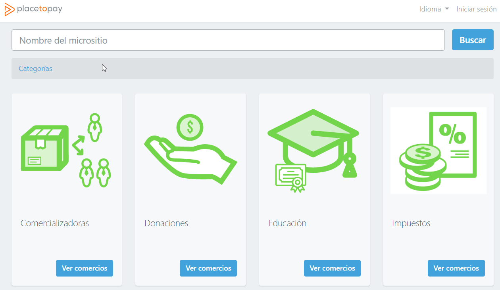
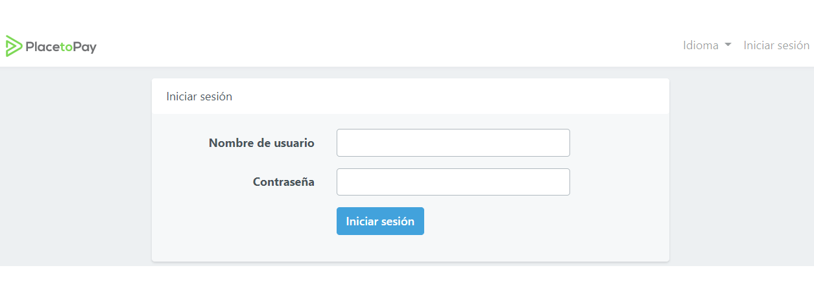
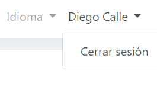

# Entrada y salida del software

## Ingreso 

El sistema permite acceder a las funcionalidades dependiendo del grupo de permisos que sea configurado desde la aplicación Panel de Placetopay, con el fin de habilitar los módulos que son requeridos para ejecutar sus actividades.

Para ingresar a Microsites Colombia debes ingresar a la URL [https://sites.placetopay.com/](https://sites.placetopay.com/)
Para ingresar a Microsites Ecuador debes ingresar a la URL [https://sites.placetopay.ec/](https://sites.placetopay.ec/)

Una vez dentro del software, para iniciar sesión pulsar en **"Iniciar sesión"**

El sistema habilitará el formulario de inicio de sesión, en el cual se ingresa Nombre de usuario, Contraseña y se oprime **"Iniciar sesión"**.

## Salida

Para salir del sistema se podrá hacer de varias formas.

- La forma más segura es seleccionar el icono  que se encuentra en la parte superior derecha de la ventana, donde se despliega una lista como se muestra a continuación y ahí selecciona la opción, **Cerrar sesión**.
  
  

- Se podrá salir del sistema cerrando la pestaña del navegador o cerrando directamente el navegador, sin embargo la sesión no se cerrará automáticamente, generando brechas de seguridad debido a que es posible que la sesión quede iniciada. Se recomienda siempre usar la primera opción para salir del sistema. 
