# Recursos

El administrador del sistema tiene acceso a los módulos que permiten configurar la aplicación, entre ellos la creación y configuración de los diferentes tipos de micrositios, crear y administrar otros usuarios desde la [consola de PlacetoPay](https://panel.placetopay.com), a su vez el usuario final podrá ejecutar diferentes acciones previamente configuradas por el administrador.

Es de resaltar que el administrador no podrá crear, anular, autorizar o pagar una factura desde la plataforma de administración de micrositios.

Para un comercio empezar a utilizar la plataforma de micrositios debe estar configurado en la [consola de PlacetoPay](https://panel.placetopay.com) y de igual forma los sitios que hacen parte de este y que interactuarán con el micrositio y demás funcionalidades del sistema.

A continuación se explica como funciona el sistema de [Micrositios](https://sites.placetopay.com/) de PlacetoPay

## Facturas

En este módulo se pueden ejecutar varias actividades las cuales permiten tener un control de las facturas con las que se desea interactuar en el sistema.

Vale anotar que desde aquí al igual que desde la [consola de PlacetoPay](https://panel.placetopay.com/) se pueden importar desde un archivo las facturas que se deben pagar desde un micrositio cerrado.

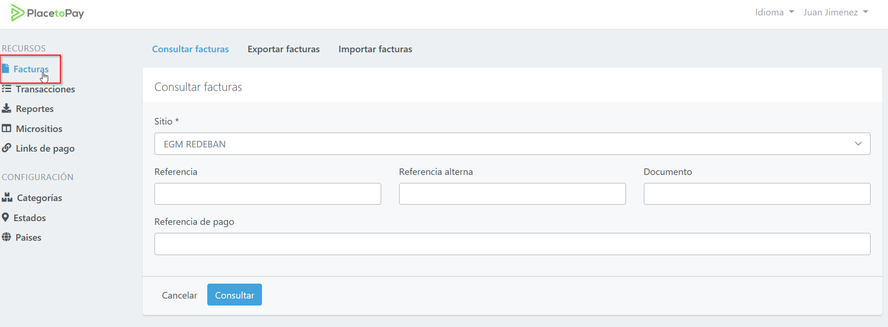

### Consultar facturas

El usuario desde aquí puede **Consultar facturas** que se han pagado o tienen un intento de pago. 

Para realizar una consulta es necesario ingresar al sitio en el que se realizó el recaudo y si desea realizar la consulta más específica puede ingresar otros datos como se muestra en el formulario y posteriormente debe seleccionar el botón **Consultar** para que se genere el resultado de la consulta.

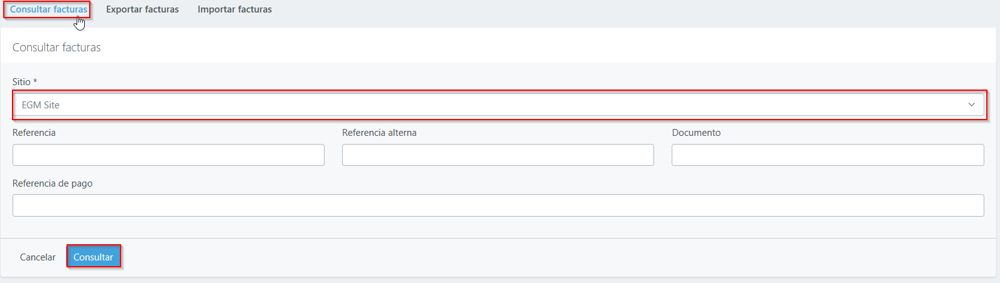

La consulta permite visualizar los cinco últimos registros de pagos de facturas.
Los registros resaltados de color verde se identifican como transacciones con estado aprobada y los resaltados de color blanco son transacciones que presentaron un estado diferente en el proceso transaccional.

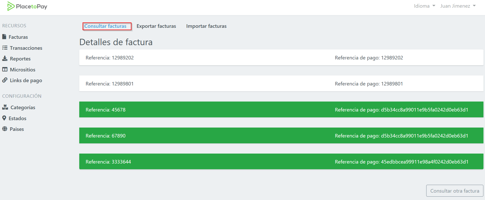

Para ver el detalle de transacción de una factura solo necesita seleccionar la referencia de la factura que se desea visualizar:

En caso de que algún campo se muestre con el valor “No hay datos” significa que el usuario o el comercio no los ingresó en el proceso de cargue de la factura o en la transacción. 

Puedes regresar al inicio dando clic en el botón **Consultar otra factura** o en caso de que algún dato ingresado no tenga pagos asociados le saldrá un aviso para que rectifique la información ingresada.

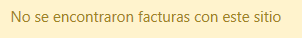

### Exportar facturas

El sistema permite exportar las facturas de los micrositios que están creados en el sistema en algunos formatos que se tienen previamente configurados.

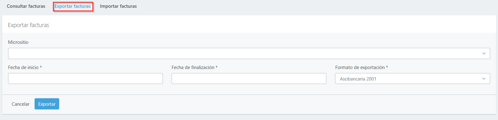

Para realizar el exporte es necesario seleccionar el micrositio que contiene las facturas a exportar.

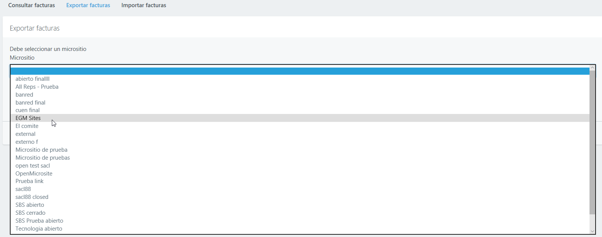

Posteriormente debe ingresar el rango de fechas que contiene las facturas que se desean exportar, que no puede ser superior a 31 días calendario y finalmente selecciona el formato de exportación.

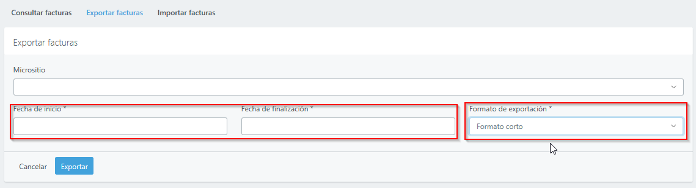

Los formatos de exportación difieren dependiendo del país:

* El **Formato corto** y **Formato universidades** aplican solo para Ecuador.
* Los formatos **Asobancaria 2001** y **Asobancaria 2011** aplican solo para Colombia.

**Formatos**: En caso de seleccionar algunos de los formatos y dar clic en el botón **Exportar** aparecerá una interfaz para descargar el archivo en formato <code>.zip</code>:

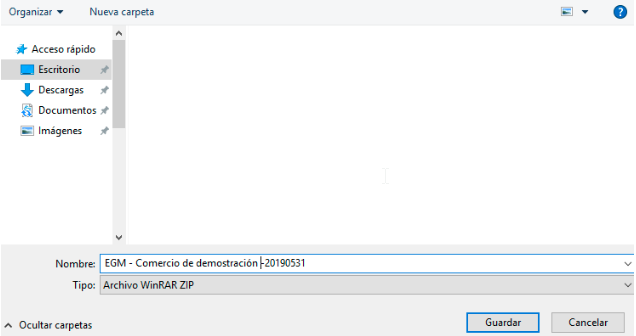

Posteriormente debe dar clic en **Guardar** para completar la descarga, allí en la ubicación escogida debe aparecer una carpeta comprimida la cual deberá extraer para verificar los archivos, así:

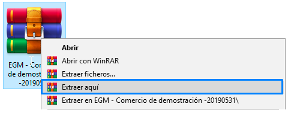

Luego aparece una carpeta la cual debe contener los archivos planos de las facturas consultadas en los filtros anteriormente establecidos con la siguiente información:

**Formato corto**

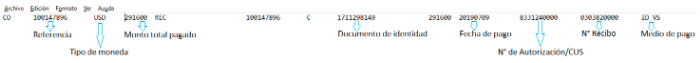

**Formato universidades**

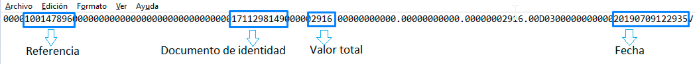

### Importar facturas

El sistema permite importar de forma masiva a partir de un archivo con formatos diferentes las facturas a los diferentes micrositios que se tengan creados en el sistema, como lo pueden ser: <code>.xls</code> para archivos de excel, <code>.txt</code> para archivos de texto y <code>.csv</code> para archivos separados por comas, .

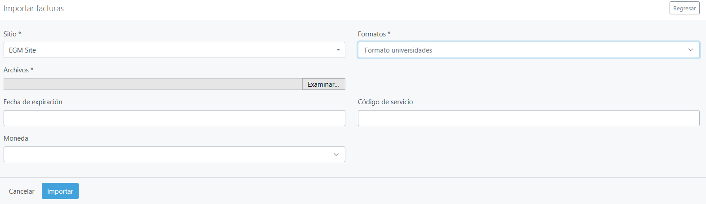

**Formato universidades**

En esta opción el archivo debe estar parametrizado con las siguientes condiciones:

|No|Campo|Longitud|Descripción|
|--|-----|--------|-----------|
|1|Número de prefactura|13|DEBE SER VALOR NUMÉRICO|
|2|Nombre|30|NOMBRE DEL DEUDOR DE LA FACTURA|
|3|Cédula (CI)|10|DEBE SER VALOR NUMÉRICO|
|4|Valor|9|7 ENTEROS Y 2 DECIMALES|
|5|Fecha|8|AAAAMMDD, FECHA MÁXIMA DE PAGO|
|6|Estatus|1|POR DEFECTO SE INGRESA LA LETRA "E"|
|7|Código de universidad|3|VALOR NUMÉRICO ASIGNADO POR EL BANCO A LA UNIVERSIDAD|

El archivo para poderlo importar desde un archivo de texto debe quedar como se muestra a continuación:

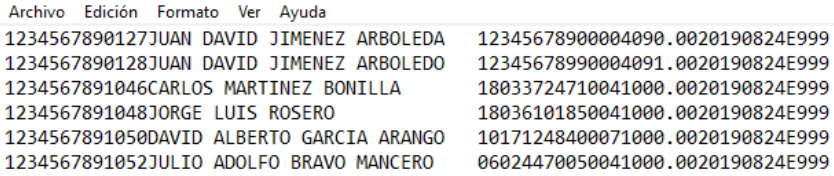

**Formato corto**

Para el importe del archivo en el formato corto se deben cumplir con las siguientes especificaciones:

|NO.|CAMPO|DESCRIPCION|TIPO|LONG.|OBLIGATORIO|
|---|-----|-----------|----|-----|-----------|
|1|Código de Orientación|Campo fijo CO = Cobro|CHAR|2|Si|
|2|Contrapartida|Referencia principal|CHAR|20|Si|
|3|Moneda|Código de Moneda del Movimiento. Campo fijo USD = Dólares|CHAR|3|Si|
|4|Valor|Valor del Movimiento = 11 enteros y 2 decimales. No utilizar separadores de miles ni de decimales, por ejemplo si el valor del movimiento es 12.645,76 colocar 1264576|NUM|13|Si|
|5|Forma de cobro|Campo fijo REC = Recaudación|CHAR|3|Si|
|6|Tipo de cuenta|No aplica|CHAR|3|No|
|7|Número de cuenta|No aplica|NUM|20|No|
|8|Referencia|Descripción|CHAR|40|Si|
|9|Tipo ID|Tipo de Identificación del beneficiario o deudor. Campo fijo C = Cédula , R = RUC, P = Pasaporte|CHAR|1|Si|
|10|Número ID|Número de Identificación del beneficiario o deudor|CHAR|14|Si|
|11|Nombre|Nombre del beneficiario o deudor|CHAR|41|Si|
|12|Base imponible|Si no tiene dato se asume el monto del campo Valor. Registrar 11 enteros y 2 decimales. No utilizar separadores de miles ni de decimales, por ejemplo si el valor del movimiento es 12.645,76 colocar 1264576|NUM|13|Si|

Para poder importar desde un archivo <code>.csv</code>  el *formato corto* debe quedar como se muestra a continuación:

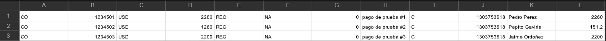

* Para proceder con el cargue de las facturas en alguno de los formatos debe ingresar los siguientes campos:

**Sitio**: Este campo es de obligatorio ingreso, en este se despliegan los sitios configurados en la consola de PlacetoPay y en el cual se asocian los registros a importar.  
**Formato**: Debe seleccionar el formato universidades. 
**Archivos**: Este campo es de obligatorio ingreso, desde este debes seleccionar el archivo ya guardado en tu computador y configurado con las condiciones anteriormente presentadas. 
**Fecha de expiración**: Este campo es de obligatorio ingreso, donde el usuario seleccionará en el calendario la fecha y hora de expiración de las facturas (corte), donde una vez superada ésta quedarán inhabilitadas las facturas para su pago. 
**Código de sevicio**: Este campo es de obligatorio ingreso, donde el usuario ingresará el código de servicio especificado por el comercio con el cual identificarán la factura a qué producto/servicio está asociada. 
**Moneda**: Este campo aparece para el formato Universidades es de obligatorio ingreso, donde el usuario seleccionará el tipo moneda el cual estarán asociados los pagos. Los tipos de moneda allí desplegados son los que el comercio tiene habilitado.

Luego de ello debes dar clic en el botón **Importar** donde se te notificará con el mensaje **Validación finalizada, se importarán X facturas** si fue satisfactorio el importe.

Adicionalmente, le debe llegar al correo electrónico del usuario logueado la siguiente confirmación notificando que el cargue de las facturas fue exitoso:

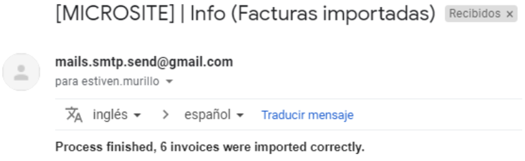

* De forma similar funcionan los demás formatos expuestos aquí.
* Para los formatos Asobancaria 2001 no se tiene en cuenta la fecha de expiración ni el código de servicio.
* Los campos mencionados son obligatorios de acuerdo al formato seleccionado.
* Para cada país sólo se mostrarán los formatos que apliquen.

## Transacciones

Este módulo permite ejecutar diferentes funcionalidades para visualizar las transacciones que se realizan desde los micrositios.

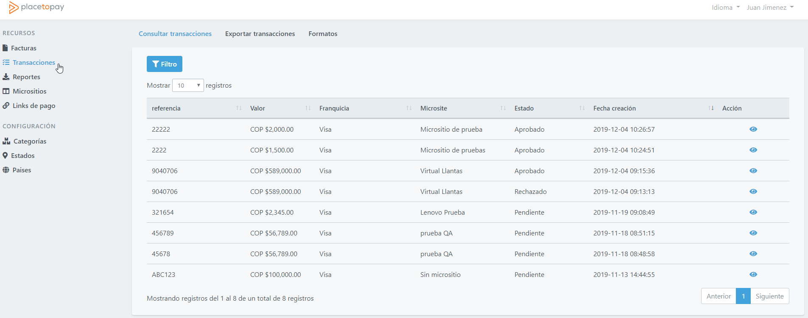

### Consultar transacciones

Al ingresar a transacciones puede visualizar las transacciones realizadas durante las dos últimas horas desde los micrositio asociados.

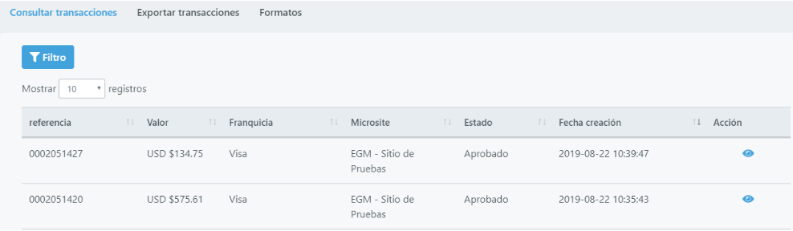

Cuando selecciona la acción de [**Visualizar**](/general/icon.md#visualizar) inmediatamente después se ejecuta el detalle de la transacción como se muestra a continuación:

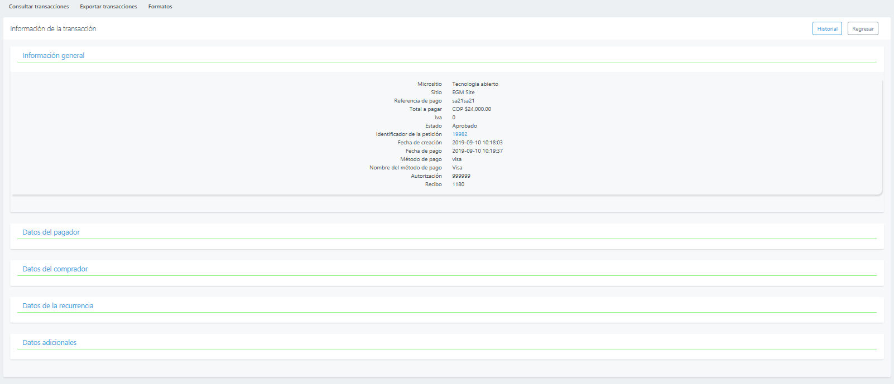

En caso de que no pueda visualizar la(s) transacción(es) requerida(s) en este menú, puede seleccionar el botón  donde le aparecerá la siguiente vista:

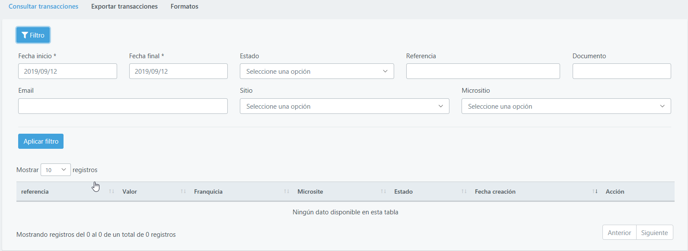

Sobre esta vista el usuario debe seleccionar de forma obligatoria un rango de fecha no superior a 31 días para su debida búsqueda. Para simplificar la consulta puede ingresar el dato que se solicita en los demás campos.

### Formatos

En esta opción el usuario puede administrar los formatos de exporte los cuales determinan qué campos de los micrositios abierto serán exportados del detalle de las transacciones en los formatos.

Al momento de dar clic en **Formatos** le aparecerá una vista con los formatos ya creados.

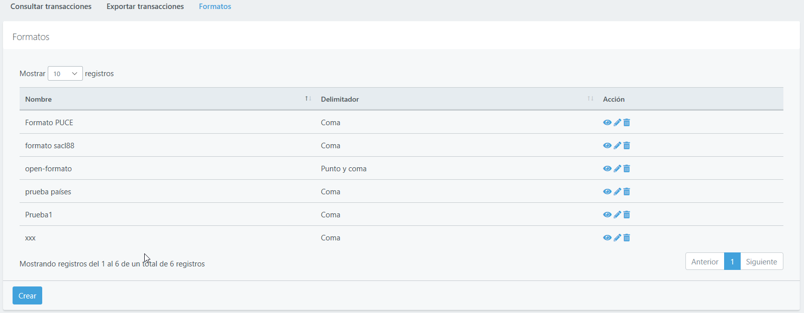

#### Crear

Cada registro que se genera al crear un formato se puede [**Visualizar**](/general/icon.md#visualizar), [**Editar**](/general/icon.md#editar) y [**Eliminar**](/general/icon.md#eliminar).

Para proceder a crear un formato solo debes seleccionar el botón **Crear** y el sistema inmediatamente después ejecuta la vista de creación,donde todos los campos son obligatorios **"*"**:

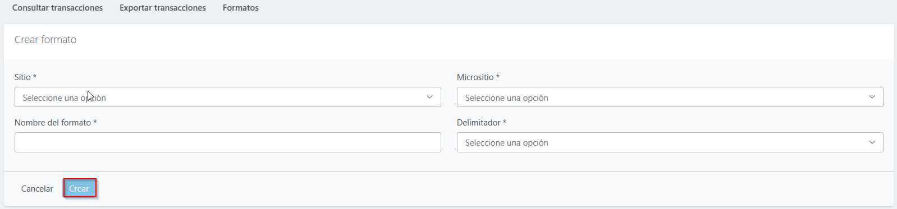

**Sitio**: Despliega los sitios asociados en el [panel de PlacetoPay](https://panel.placetopay.com), en este debes seleccionar el sitio al que está asociado el micrositio que deseas crear el formato de exportación.  
**Micrositio**: En este se despliegan los micrositios creados en el sistema y al seleccionar el **Sitio** se filtran los micrositios asociados a este. 
Al seleccionar el sitio se despliegan todos los campos configurados en el momento de la creación del micrositio.
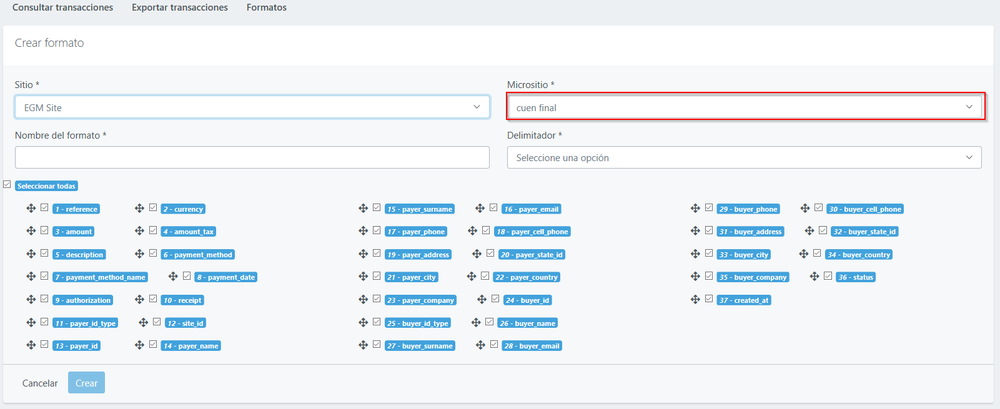
**Nombre del formato**: En este campo se debe ingresar el nombre con el que se identificará el formato a crear. 
**Delimitador**: Desde este campo se debe seleccionar el delimitador o el separador de cada dato que hará parte para los registros del exporte. Los cuales pueden ser coma ",", punto y coma ";" y tabulador "  ". 

Cuando se ingresan todos los datos a los campos mencionados se debe proceder a seleccionar los campos que deseas que se exporten de los registros de las transacciones.

También puedes definir el orden en que deseas que se exporten los campos dando clic sostenido sobre el campo cuando aparece el cursor 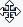, lo puedes mover así entre los campos y lo ubicas en una posición deseada.

Finalmente seleccionar el botón **Crear** para que puedas hacer uso del formato en el momento de querer exportar los registros de transacciones.

### Exportar transacciones

Desde esta opción puedes realizar un exporte de las transacciones realizadas bajo los sitios que tiene el comercio asociado dependiendo de las condiciones aplicadas de la siguiente forma:

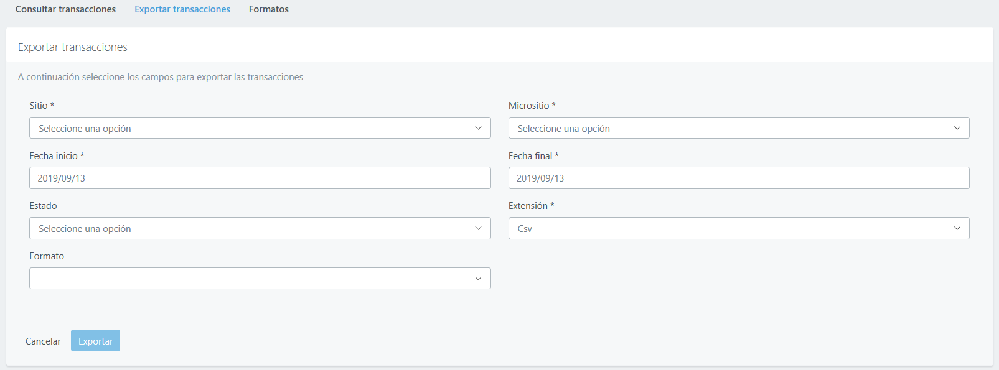

Se debe tener en cuenta que los campos obligatorios contienen un ""*"" para que se puedan identificar fácilmente.

**Sitio**: Despliega los sitios asociados en el [panel de PlacetoPay](https://panel.placetopay.com), en este debes seleccionar el sitio que contiene los registros que deseas exportar.   
**Micrositio**: Al momento de seleccionar el sitio en este campo se despliegan los micrositios asociados a este, donde debes seleccionar el que contiene los registros de transacción que deseas exportar.    
**Fecha de inicio**: En este campo debes seleccionar en el calendario la fecha de inicio desde donde se realizará la consulta de las transacciones.   
**Fecha de finalización**: Posterior a la fecha de inicio debes seleccionar en el calendario la fecha de fin hasta  donde se realizará la consulta de las transacciones.  
El rango de fechas para la exportación no debe ser superior a 31 días calendario.  
**Estado**: Desde este campo puede seleccionar un estado final de las transacciones, en caso de dejarlo en blanco, el exporte traerá todos los estados relacionados.   
**Extensión**: En este se debe seleccionar la extensión del archivo para su descarga, <code>.Xlsx</code> para archivos de excel, <code>.txt</code> para archivos de texto y <code>.csv</code> para archivos separados por comas.   
**Formato**: Debe seleccionar uno de los formatos configurados con el cual se parametriza los campos a exportar.
Este campo sólo aparece si el sitio y micrositio seleccionado tienen un formato para la exportación creado, como se describió en la opción [Formatos](/administrator_role/resources.md#formatos).

## Reportes

Desde el módulo de reportes puedes visualizar todos los exportes realizados desde la opción de [Exportar transacciones](/administrator_role/resources.md#exportar-transacciones) del módulo de transacciones.

Cada registro permite descargar el reporte, eliminar el reporte o ver el detalle del reporte de transacciones, según sea la necesidad. 

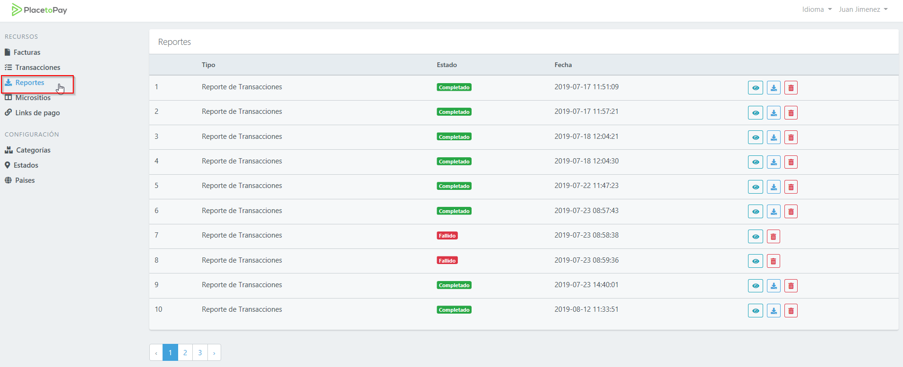

Cuando te diriges a ver el detalle de un reporte también desde allí lo puedes descargar o borrar. Igualmente se puede dar cuenta si el reporte se ha descargado completamente por medio del **Estado**, también puede ver el rango de fecha y el **Formato** que utilizó para el exporte de los registros.

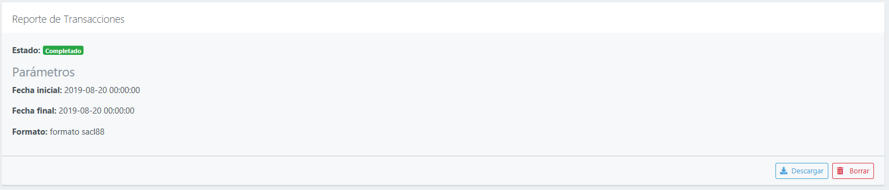

Cuando un reporte es descargado se puede visualizar así:

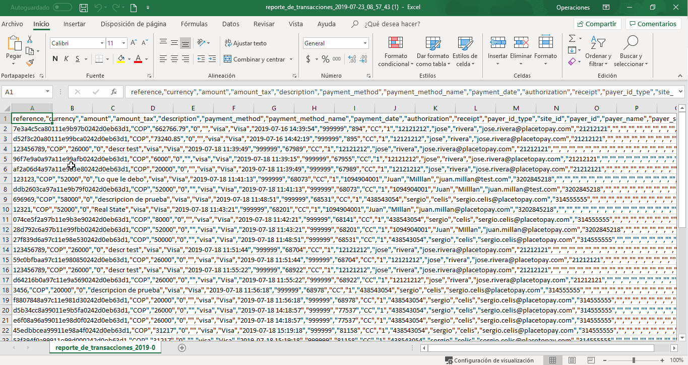

## Micrositios

Los Micrositios son tanto para venta como para recaudadores. Estos son para aquellos clientes que quieren integrarse a PlacetoPay de una forma efectiva y sin realizar mucho desarrollo.

Actualmente el sistema maneja varios tipos de micrositios como lo son los micrositios abiertos, cerrados, externos y personalizados. 
Los micrositios personalizados son para clientes que requieren formularios particulares y que pueden ser desarrollados sobre la plataforma, estos formularios particulares son diferentes porque llegan directamente con la base de datos del comercio por medio de una integración utilizando los web services de ambas partes.

La diferencia entre el micrositio abierto y cerrado es que en el cerrado hay una base de datos con unas facturas y el usuario entra a pagar el valor de esa factura. En el abierto, por el contrario,  el usuario decide cuánto quiere pagar adicionalmente estos permiten configurar formularios en los que el comercio decide qué campos quiere pedir y qué validaciones tendrán esos campos.

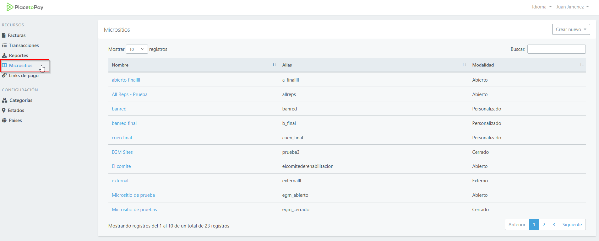

***Antes de crear un micrositio debes tener en cuenta***:

1. Para acceder al panel administrador de Sites debe ser con un usuario (creado en la consola de PlacetoPay) que tenga permisos administradores. 
2. Para verificar esto, accede a la [consola de PlacetoPay](https://panel.placetopay.com/) e intenta editar un sitio, sí lo puedes hacer significa que puedes crear sin problema un micrositio, pero en el caso contrario no lo podrás hacer.
3. Debes saber la información que se solicita en el formulario de creación:

* *Sitios*: es el sitio(s) creado en la consola de PlacetoPay al cual será asociado al micrositio que se creará.
* *Nombre*: es el nombre que adoptará el micrositio tanto en la panel administrador de Sites como en el título de la página.
Se recomienda que sea igual al que tiene en la consola administrativa de PlacetoPay
* *Alias*: es el nombre que adoptará el micrositio en su dirección web para ingresar desde un navegador.
* *Categorías*: es la categorización que se le asigna al micrositio por la actividad económica del comercio (Comercializadoras, Donaciones, Educación, Inmobiliarias, Medios de Comunicación, Recaudos, Seguros y Viajes y Turismo).Un micrositio puede estar en una o varias categorías. Esta lista depende de las categorías que se hayan creado en el sistema.
* *Expiración del pago (minutos)*: es el tiempo límite que el usuario puede tomar para ingresar toda la información en la redirección de PlacetoPay para concluir su pago. Este campo no aplica para los micrositios externos.
* *Código Css*: no es obligatorio estos datos, pero si el comercio lo requiere puede agregar el código que permita dar un estilo a la interfaz del micrositio. Este campo no aplica para los micrositios externos y personalizados.
* *Encabezado*: debe de ser un archivo con formato de imagen <code>.png</code> o <code>.jpg</code> que se ubicará en la parte superior del formulario del micrositio, las dimensiones recomendadas deben ser 1140px, 140px y el tamaño máximo del archivo debe ser 3MB. Este campo no aplica para los micrositios externos y personalizados.
Este logo lo debe configurar en la consola administrativa de PlacetoPay para que en el WebCheckout se visualice el logo del comercio.
* *Logo*: Igual al encabezado debe de ser un archivo con formato de imagen <code>.png</code> o <code>.jpg</code> que aparecerá en el home del micrositio, las dimensiones recomendadas deben ser 512px, 512px y el tamaño máximo del archivo debe ser 3MB. Este campo no aplica para los micrositios externos y personalizados.
* *Pie de página*: debe de ser un archivo con formato de imagen <code>.png</code> o <code>.jpg</code> que se ubicará en la parte inferior del formulario del micrositio para que actúe como footer, las dimensiones recomendadas deben ser 1140px, 140px y el tamaño máximo del archivo debe ser 3MB. Este campo no aplica para los micrositios externos y personalizados.

4. Se debe saber si el micrositio tendrá las siguiente funcionalidades:

* *Permitir pagos parciales*: Esta opción se debe habilitar cuando el comercio permite pagar una o varias facturas con diferentes medios de pago sobre una misma sesión o también permite sobre varias transacciones pagar una factura.

**Opciones adicionales micrositios abiertos**:
* *Generar referencias automáticamente*: esta opción aplica para los comercios que quieren que en el campo referencia se genere un dato automático el cual puede ser modificado por la persona que esté gestionando un pago.

* *Permitir múltiples pagos con la misma referencia*: esta opción se debe utilizar cuando un comercio permite utilizar en diferentes facturas la misma referencia de pago.

* *Habilitar recurrencia*: la recurrencia aplica para los comercios que cobran en un periodo determinado un monto que no debe variar en el tiempo para que pueda ser descontado automáticamente de una cuenta inscrita previamente.

**Opciones adicionales micrositios cerrados**:
* *Valor servicio*: es el valor adicional que el comercio puede asignar a la factura por el proceso transaccional u otros costos.
* *Campos de acceso*: *Referencia, documento, referencia alterna*. Los campos de acceso se configuran para consultar las facturas que el comercio provee para gestionar el pago por el micrositio, se pueden configurar mínimo dos campos en cualquiera de sus combinaciones, o en su defecto los tres campos mencionados anteriormente. 
* *Mostrar únicamente factura con referencia asociada a los campos de acceso*: Al habilitar esta opción el sistema solo consulta las facturas que hagan parte de los datos de acceso ingresados de lo contrario mostrará todas las facturas pendientes de pago por el cliente.
* *Mostrar consecutivo*: Agrega columna de consecutivo que aumenta por cada factura con referencia alterna y documento igual, lo cual permite diferenciar las facturas que se están pagando.
* *Permite pagar varias facturas a la vez*: Con esta opción habilitada un usuario puede seleccionar varias facturas a la vez creando una referencia automática en los datos adicionales de la  transacción en la consola administrativa de PlacetoPay donde aparecerán las referencias de las transacciones pagadas.
* *Pagar más antiguas primero*: Cuando esta opción se habilita, al ingresar a la pantalla de pagos el sistema no permite pagar si no se han seleccionado o pagado las facturas más antiguas primero.
* *No almacenar sesión en webCheckOut*: Esta opción se puede utilizar cuando tienes pagos parciales habilitados y deseas controlar que no se almacene el correo electrónico en la [plataforma de pago](/user_end/actions.md#plataforma-de-pago) cuando realizas un pago parcial, ya que si no está habilitada esta opción la próxima vez que se ingrese a completar un pago parcial no pedirá el correo electrónico.

**Opciones adicionales micrositios personalizados**:
* *Servicio*: Este campo permite seleccionar el servicio al que se debe asociar el micrositio personalizado, estos servicios se desarrollan con anterioridad dando cumplimiento a una serie de requerimientos de integración con el comercio, por parte del área de tecnología de PlacetoPay.

* *Logo para la categoría*: debe de ser un archivo con formato de imagen <code>.png</code> que se ubicará en el cuerpo de [sites](https://sites.placetopay.com/), las dimensiones recomendadas deben ser 277.5px, 463.84px y el tamaño máximo del archivo debe ser 3MB.

**Opciones adicionales micrositios externos**:
* *Logo para la categoría*: debe de ser un archivo con formato de imagen <code>.png</code> que se ubicará en el cuerpo de [sites](https://sites.placetopay.ec/), las dimensiones recomendadas deben ser 277.5px, 463.84px y el tamaño máximo del archivo debe ser 3MB.

* *Url de la página web*: este campo permite ingresar una url la cual direcciona al usuario al micrositio desde la categorías que tiene la plataforma [sites](https://sites.placetopay.com/)

5. Todos los micrositios en el proceso de creación tienen la opción de  ***Deshabilitar micrositio*** habilitada ya que este no puede estar activo hasta que no se realicen pruebas de marcha blanca y hasta que salgan a producción con el fin de que ningún usuario haga un pago sin que éste micrositio se encuentre totalmente funcional para el lado del comercio.

### Crear micrositio

Cuando selecciones la opción de micrositios y deseas crear uno, debes seleccionar la opción **Crear nuevo** que se encuentra en la parte superior derecha del formulario:

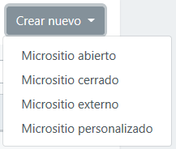

A continuación se debe seleccionar el tipo de micrositio que desees crear donde debes tener en cuenta las recomendaciones mencionadas al inicio para diligenciar cada uno de los campos que se visualizan en los formularios de los diferentes tipos de micrositios.

##### Micrositio abierto

Cuando seleccionas micrositios abiertos se abre el siguiente formulario:

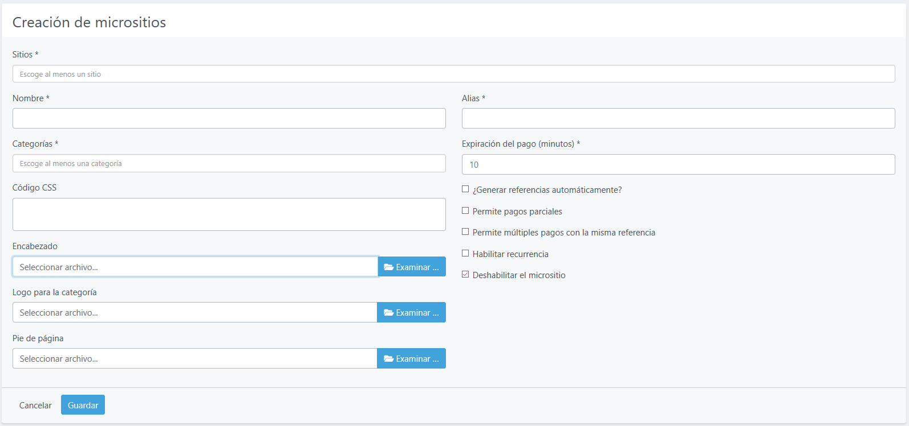

Posteriormente debes ingresar los datos que el comercio provee para la creación del micrositio abierto.

Finalmente debes seleccionar el botón **Guardar** donde se genera un detalle con los datos ingresados y puedes editar, eliminar, ver el micrositio con la configuración que se le estableció, configurar campos y modificar las traducciones de los campos que son permitidos para el micrositio abierto.

##### Micrositio cerrado

Cuando seleccionas micrositios cerrado se abre el siguiente formulario:

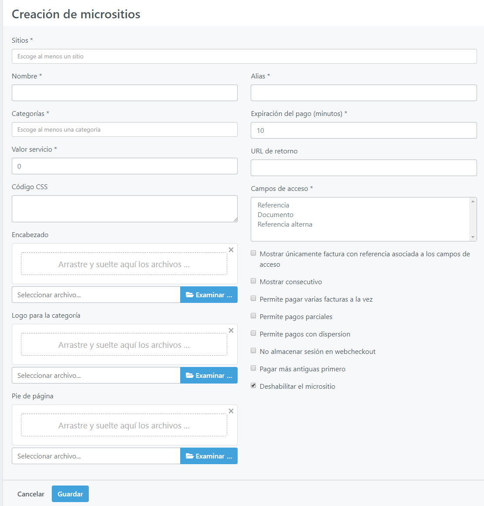

Desde aquí se ingresan los datos que el comercio provee para la creación del micrositio cerrado.

Para terminar con la creación del micrositio cerrado debes seleccionar el botón **Guardar** inmediatamente el sistema genera un detalle con la información ingresada, donde puedes editar, eliminar, ver el micrositio con la configuración que se le realizó y modificar las traducciones de los campos que son permitidos para el micrositio cerrado.

##### Micrositio externo

Cuando seleccionas micrositios externo se abre el siguiente formulario:

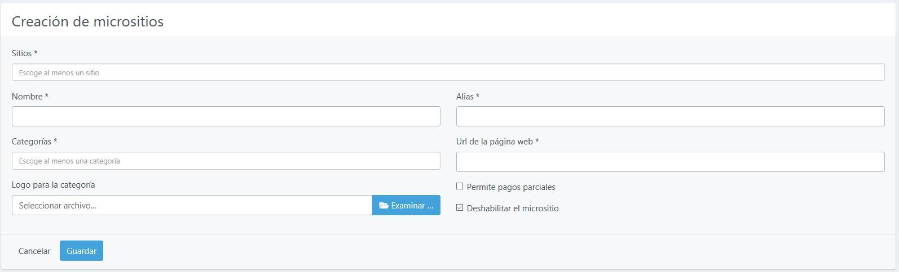

A continuación debes ingresar los datos que el comercio provee para la creación del micrositio externo.

Para terminar con la creación del micrositio externo debes seleccionar el botón **Guardar** donde el sistema genera un detalle con la información ingresada y puedes editar, eliminar o ver el micrositio con la configuración que se realice.

##### Micrositio personalizado

Cuando seleccionas micrositios personalizado se abre el siguiente formulario:

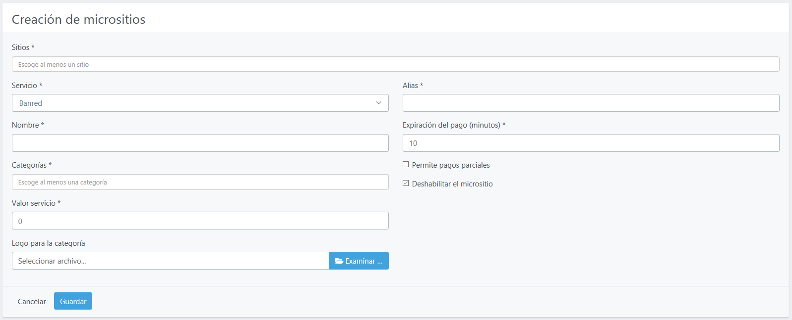

Inmediatamente después debes ingresar los datos que el comercio provee para la creación del micrositio personalizado.

Finalmente debes seleccionar el botón **Guardar** e inmediatamente el sistema genera un detalle con la información ingresada, desde aquí puedes editar, eliminar, ver el micrositio con la configuración que se le realizó y modificar las traducciones de los campos que son permitidos para el micrositio personalizado.

#### Consulta y detalle de un micrositio

Cuando se guarda o se consulta un micrositio el sistema permite ver un detalle de este donde puedes visualizar los datos ingresados y acceder a diferentes funcionalidades que dependen del tipo de micrositio.

Para **Consultar un micrositio** solo debe seleccionar en el listado de micrositios el nombre del que se desee consultar.

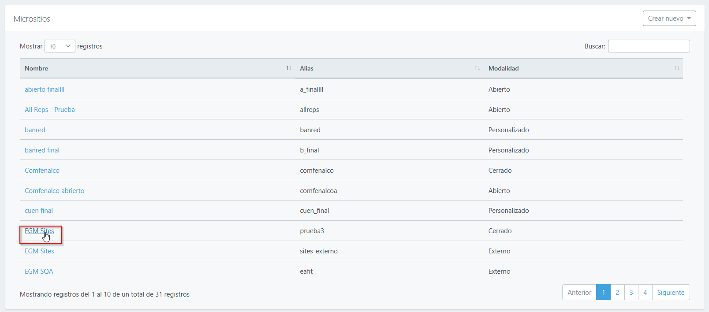

Cuando se selecciona se ejecuta un detalle que muestra los datos que dependen del tipo de micrositio creado.

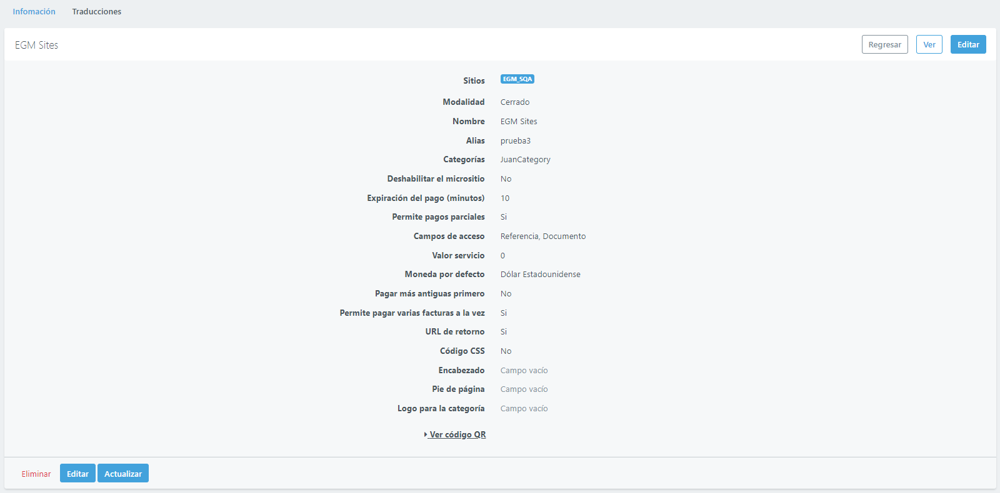

#### Crear un nuevo campo (additional data) en un micrositio abierto

Los micrositios abiertos tienen una particularidad importante dentro del sistema y es que permiten definir y diseñar nuevos tipos de campos haciendo de esta forma este tipo de micrositios los más dinámicos del sistema.

Cuando se ingresa al detalle de un micrositio abierto puedes ver en la parte superior izquierda la opción **Campos**, que al seleccionar se desprende una la lista de campos que el sistema ya tiene configurado pero que también dependen de las opciones habilitadas en el momento de la creación del micrositio.

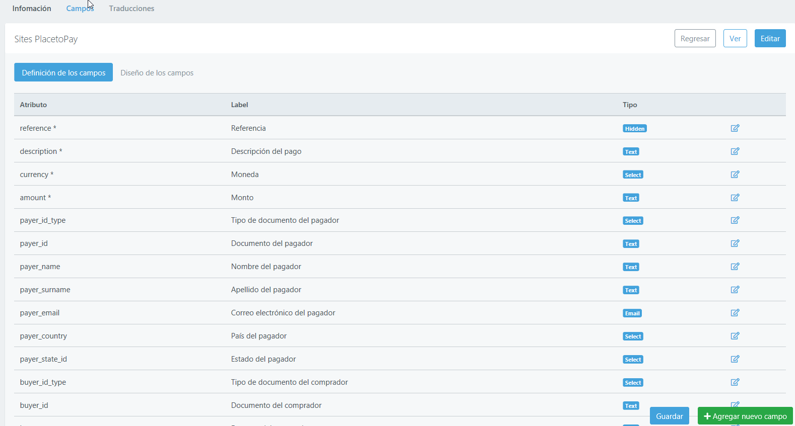

* Para la ***Definición de los campos*** en la lista se debe seleccionar el botón  ubicado en la parte inferior derecha del formulario.

* Posteriormente se abre un panel donde se debe diligenciar cada uno de los campos que lo componen con la siguiente información.

   1. *Tipo de campo*: debe seleccionar el tipo de dato que soportará el nuevo campo.

      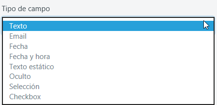

   2. *Nombre del campo*: es el nombre con el que se reconocerá la información adicional sobre la transacción en la consola administrativa de PlacetoPay. Este campo no debe contener mayúsculas ni espacios.

      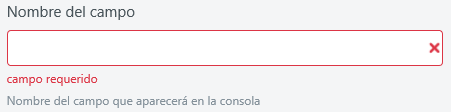

   3. *Valor por defecto*: permite ingresar el valor por defecto que puede tener el campo. No es obligatorio realizar esta opción.   
   Es requerido en caso de seleccionar un campo tipo texto estatico.

      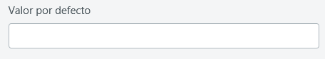

   4. *¿Es requerido?*: si el campo debe ser requerido se debe marcar la opción, en caso contrario no hacer ninguna acción.

      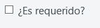

   5. *Reglas de validación*: permite definir las reglas con base en lo que entrega Laravel, entre algunas validaciones que se le pueden agregar al campo están:  tipo de campo numérico, string o alfanumérico, tamaño del campo, para mayor información [ver](https://laravel.com/docs/5.5/validation#available-validation-rules) 

      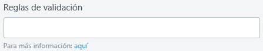

   6. *JS on change*: el sistema debe permitir ingresar un código javascript que se debe ejecutar cada vez que el campo cambia. Para más información seleccione 

      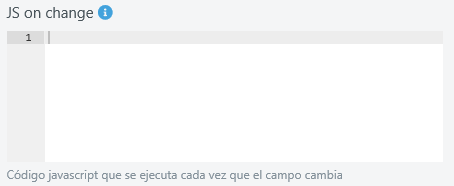

   7. *JS on bur*: puede agregar código tipo JavaScript que se debe ejecutar cada vez que el campo pierde el focus. Para más información seleccione 

      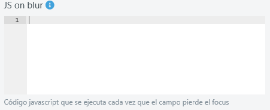

   8. *JS on validate*: puede ingresar un código javascript que permite retornar un valor  True si el valor que se ingresa al campo es válido, de lo contrario retorna False. Para más información seleccione 

      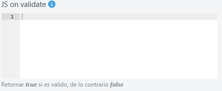

   9. *Mensajes de validación*: este campo permite ingresar un mensaje de validación para el resultado de los campos JS.

      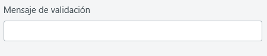

   10. Para confirmar las acciones realizadas en los campos seleccione el botón **Guardar cambios** de lo contrario seleccione **Cerrar**
   Inmediatamente se ubica el campo creado al final de la lista.

* Finalmente para mantener lo cambios y habilitar la opción ***Diseño de los campos*** y **Traducciones** seleccione el botón **Guardar** ubicado en la parte inferior izquierda del formulario.

* Sino se seleeciona el botón **Guardar** en la opción ***Diseño de los campos*** por lo menos una vez despues de que se crea el micrositio abierto la opción de **Traducciones** para este no se habilitará hasta que se ejecute la acción.

* Los campos creados pueden ser editados y borrados como se muestra a continuación:

**Editar un campo definido de un micrositio abierto**

Para editar un campo solo debes seleccionar el icono [Editar](/general/icon.md#editar), inmediatamente se desprende un nuevo formulario que muestra diferentes campos con los cuales se pueden realizar una serie de actualizaciones para la configuración del mismo, igualmente se tienen en cuenta en la creación de un campo.

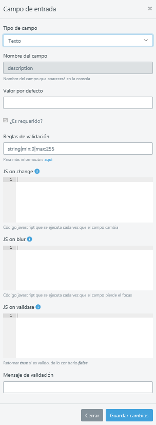

De la lista de campos por defecto, no es posible configurar campos como lo son:

* payer_country
* payer_state_id
* site_id

Hay campos a los que no es posible cambiarles el tipo:

* payer_name
* Payer_surname
* payer_email
* payer_phone
* payer_cell_phone
* payer_state_id
* payer_city
* payer_site_id
* payer_payer_id
* payer_country

Cuando se habilita recurrencia en el micrositio aparecen los campos:

* recurrent
* recurrent_date
* recurrent_interval
* recurrent_next_payment
* recurrent_max_periods
* recurrent_periodicity

**Borrar un campo definido de un micrositio abierto**

Los campos que son posible borrar muestran el icono de [Eliminar](/general/icon.md#eliminar), pero se debe tener precaución porque al seleccionar no muestra una alerta para continuar con la eliminación o cancelar el proceso, sino que desaparece de la lista de inmediato, pero la eliminación no se mantiene sino se selecciona el botón **Guardar**.

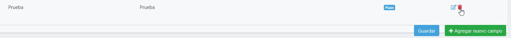

#### Agregar un nuevo campo creado en el formulario del micrositio abierto

Cuando se crea un campo se debe agregar al formulario de los micrositio abierto desde la opción ***Diseño de los campos*** para así poderlo visualizar desde el formulario de acceso al micrositio abierto.

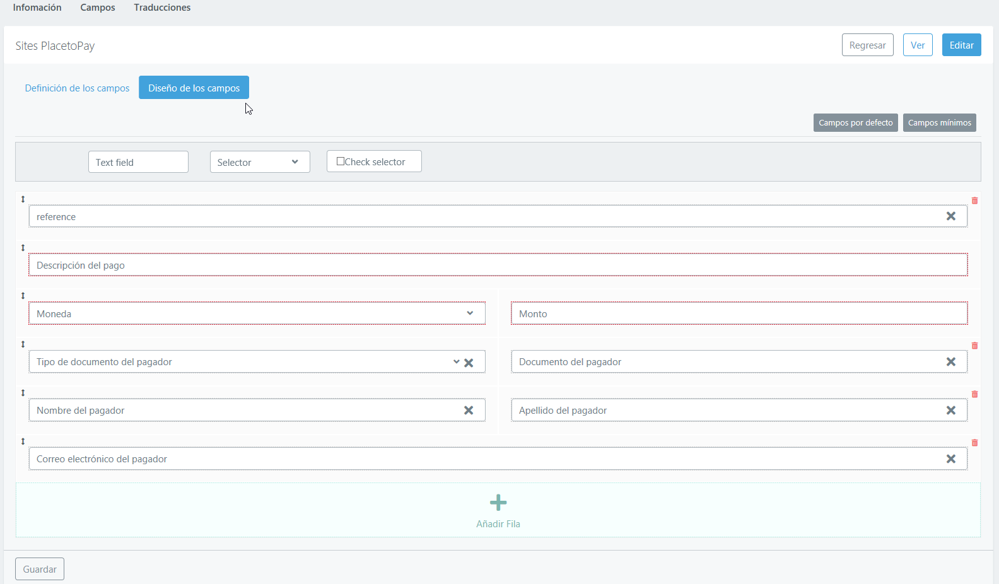

Para agregar un campo se deben seguir los siguientes pasos:

1. Seleccione el espacio ***Añadir Fila*** que se encuentra en la parte inferior del formulario.

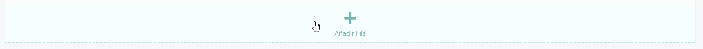

2. Inmediatamente se desprende la opción de ***Número de Columnas*** que permiten agregar una, dos o tres columnas en la fila siguiente del formulario.

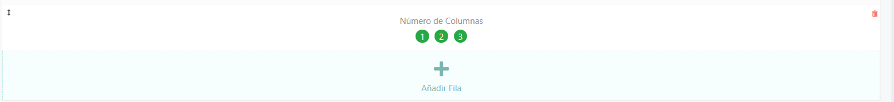

3. Seleccione la cantidad de columnas 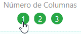 que son equivalentes a la cantidad de campos que necesita adicionar en una fila del formulario, según las especificaciones del paso anterior.

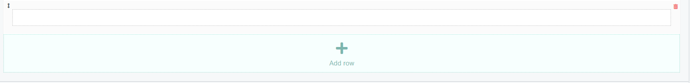

4. Seleccione el tipo de campo que [creó para el micrositio abierto](/administrator_role/resources.md#crear-un-nuevo-campo-additional-data-en-un-micrositio-abierto) y que debe agregar al formulario.

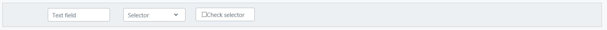

5. Con clic sostenido arrastre hasta la fila y columna que adiciono.

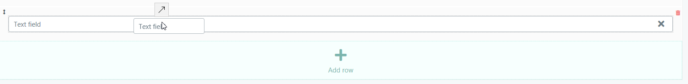

6. Cuando llegue hasta el espacio donde se desea ubicar el campo suelte el clic para que el tipo de campo se ubique en la fila y columna que se necesita.

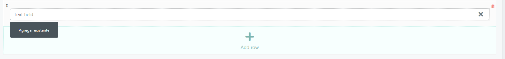

7. Seleccione la opción **Agregar existente** que se habilite para el campo.

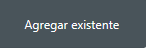

8. Inmediatamente se ejecuta una lista de campos existentes que se pueden agregar al tipo de campo que se ha ubicado.

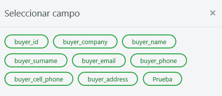

9. Seleccione el campo y este aparecerá de forma inmediata en el espacio configurado.

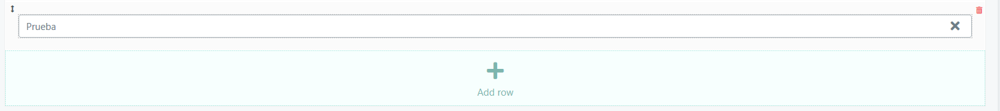

10. Verifique que los campos estén bien ubicados y agregados todos los que necesita y seleccione el botón **Guardar** ubicado en la parte inferior izquierda del formulario.

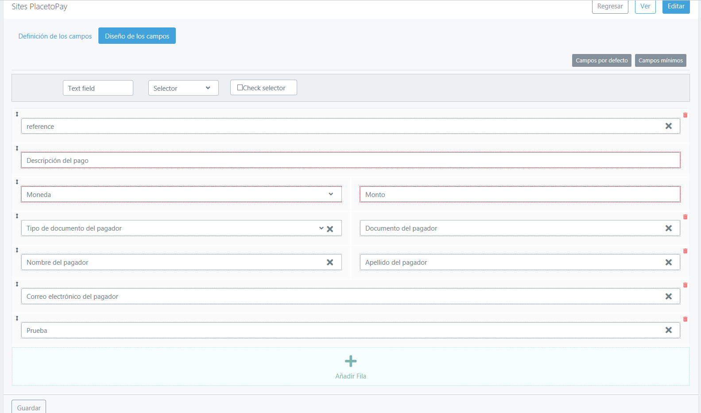

11. Seleccione el botón [Ver](/administrator_role/resources.md#ver-la-sesion-de-acceso-a-un-micrositio) para que puedas observar los cambios que realizaste en el micrositio.

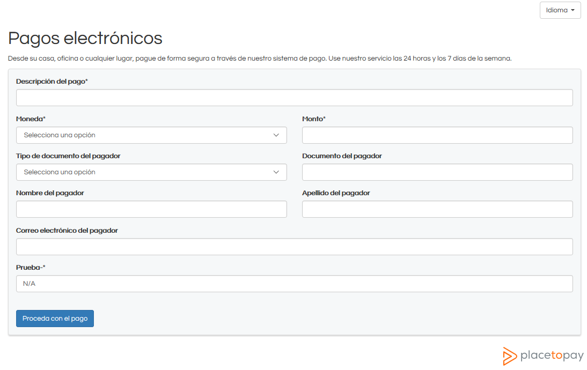

12. Ten en cuenta que si el nombre del campo muestra un texto no deseado, puedes ir a [Traducciones](/administrator_role/resources.md#traducciones-en-micrositios) a la opción de **Entrada** editar el campo y modificarlo.

**Borrar un campo diseñado de un micrositio abierto**

Un campo es posible borrar desde la opción ***Diseño de los campos*** si muestra  ya que no es un campo obligatorio ni requerido para el pago de una factura dentro del micrositio abierto.

Entonces para borrar el campo solo debe seleccionar  e inmediatamente el campo desaparece de la fila donde se encontraba.

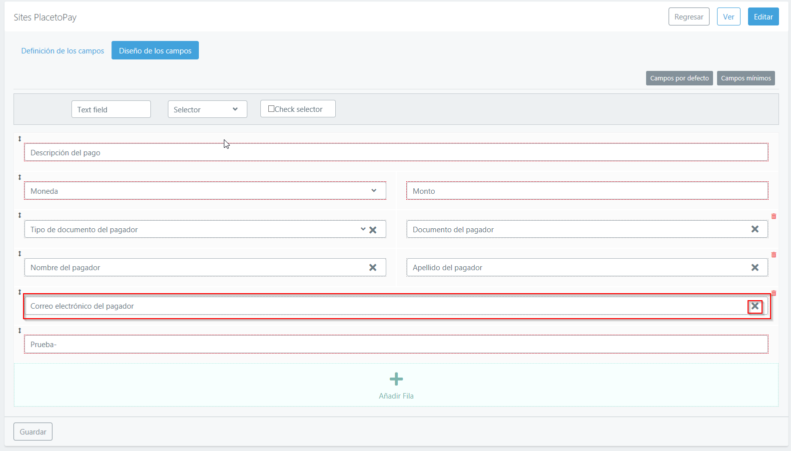

Posteriormente puede agregar en ese espacio un nuevo campo o para mantener una experiencia de usuario en el formulario se debe *eliminar la fila* seleccionando el icono [Eliminar]() que se encuentra al lado derecho de cada fila que es posible eliminar ya que no deben contener campos obligatorios ni requeridos para el micrositio abierto

Una fila que contenga campos es posible eliminarla de igual forma seleccionando el icono [Eliminar]() sin borrar primero los campos.

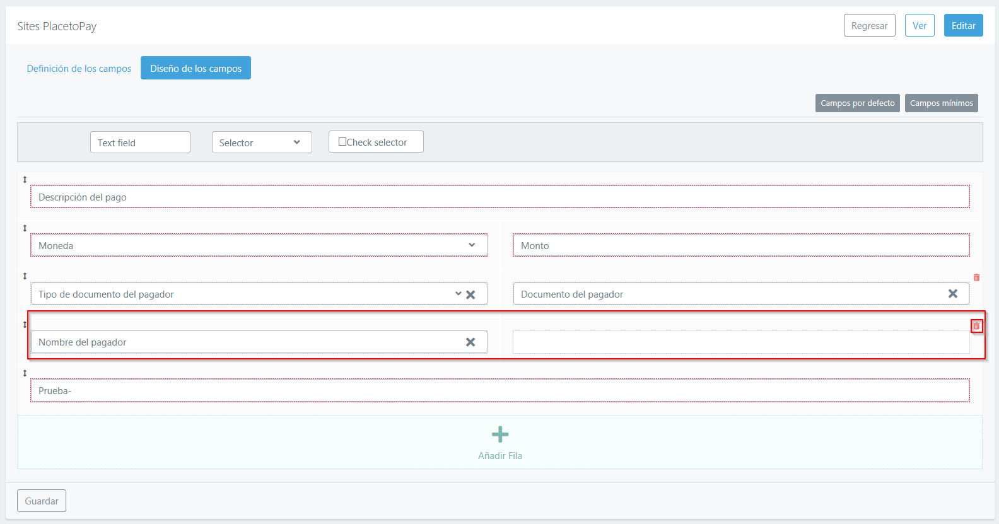

Para que los cambios se mantengan debe seleccionar el botón **Guardar** ubicado en la parte inferior izquierda del formulario.

**Mover campos en micrositio abiertos**

Cuando estás en la opción de ***Diseño de los campos*** es posible mover un campo dentro del formulario hacia otra fila o columna pero se debe tener cuidado porque si mueves un campo a una fila que contenga ya un campo agregado lo remplazará y se debe agregar nuevamente si lo deseas mantener dentro del formulario.

Para moverlo solo debes seleccionar el campo que quieres mover y con clic sostenido se debe desplazar hasta la posición deseada dentro de las filas del formulario.

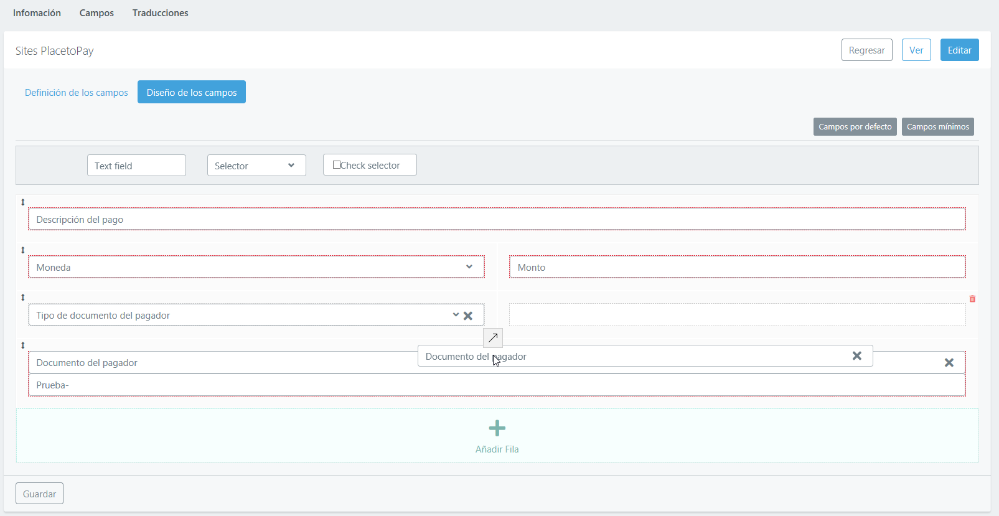

Para que los cambios se mantengan debe seleccionar el botón **Guardar** ubicado en la parte inferior izquierda del formulario.

Cuando al guardar se presenta un error por falta de algún campo requerido se genera un mensaje donde se muestra el nombre de los campos para que se agreguen.

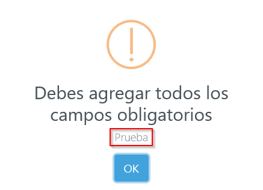

* Puedes seleccionar **Ver** para visualizar el resultado de todas las modificaciones realizadas en el micrositio abierto.

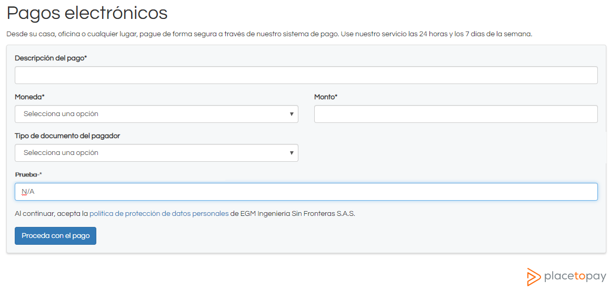

**Campos por defecto y mínimos para micrositio abiertos**

La opción de ***Diseño de los campos*** de los micrositios abiertos también cuenta con dos botónes  ubicados en la parte superior derecha de la pantalla que permiten restablecer el formulario de diseño con los campos por defecto o mínimo que debe contener el formulario.

Solo basta con seleccionar lo que se desee hacer y se obtiene como resultado:

***Campos por defecto***
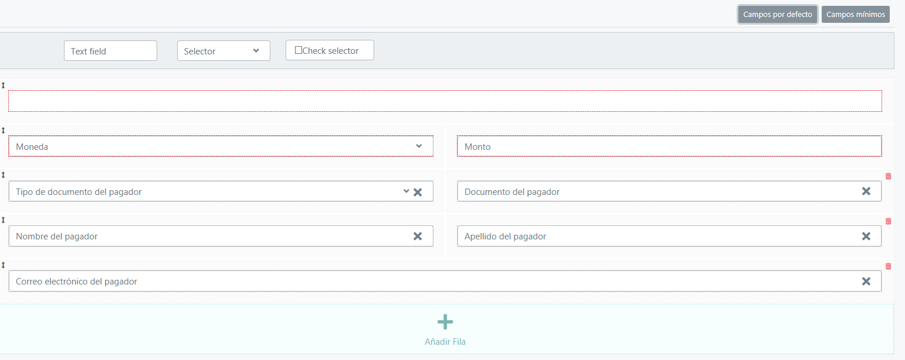

***Campos mínimos***
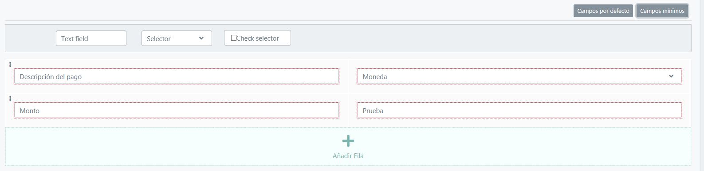

Para que los cambios se mantengan debe seleccionar el botón **Guardar** ubicado en la parte inferior izquierda del formulario.

#### Traducciones en micrositios

La mayoría de micrositios (Abiertos, cerrados y personalizados) permiten modificar en diferentes idiomas las vistas a las que el usuario final tiene acceso, como es el inicio del micrositio o el detalle de un pago, tambien de esta manera se puede agregar los términos y condiciones que se pueden visualizar allí y que no interfiere con los datos de las facturas de los clientes.

* Se recuerda que si no se seleeciona el botón **Guardar** en la opción ***Diseño de los campos*** por lo menos una vez despues de que se crea el micrositio abierto la opción de **Traducciones** para este no se habilitará hasta que se ejecute la acción ya mencionada.

1. Cuando ingresas al detalle de un micrositio puedes acceder a la opción de **Traducciones** que se encuentra en la parte superior derecha del formulario.

2. En el formulario de traducciones se pueden ver varios idiomas que dependen de aquellos que se agreguen desde la consola administrativa de [PlacetoPay](https://panel.placetopay.com) a los comercios para que se visualicen y pueda ser administrado desde el micrositio creado.

3. Cuando ingresas a la opción de *Traducciones* puedes seleccionar uno de los idiomas que deseas cambiar la traducción.

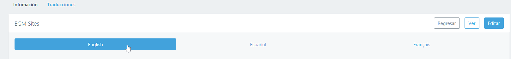

4. A continuación se debe seleccionar la vista a la que le deseas modificar los texto.

* ***Iniciar sesión***: desde esta opción se pueden actualizar las traducciones de la pantalla de acceso de los micrositios cerrados.

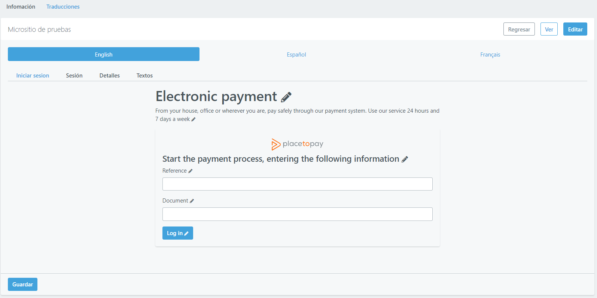 

* ***Sesión***: desde esta se pueden modificar las traducciones donde se muestran las facturas pendientes de pago de los micrositios cerrados.
* ***Entrada***: desde aquí se pueden modificar las traducciones de los datos de entrada a los micrositios abiertos y personalizados.

*Micrositio abierto*
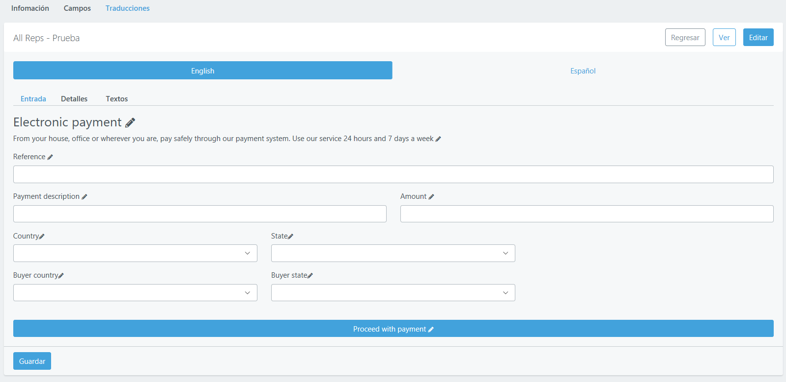

*Micrositio personalizado*
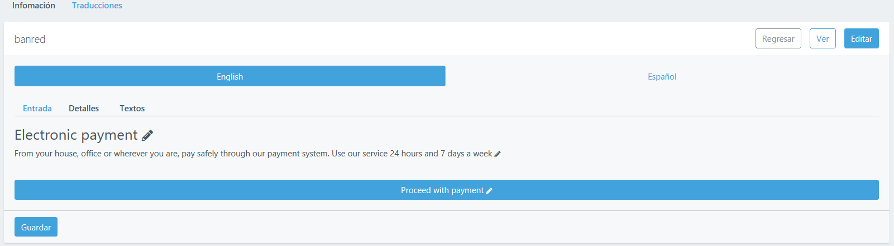

* ***Detalles***: desde esta se pueden actualizar las traducciones que se visualizan del detalle de las facturas de los micrositios después que se realiza una transacción.

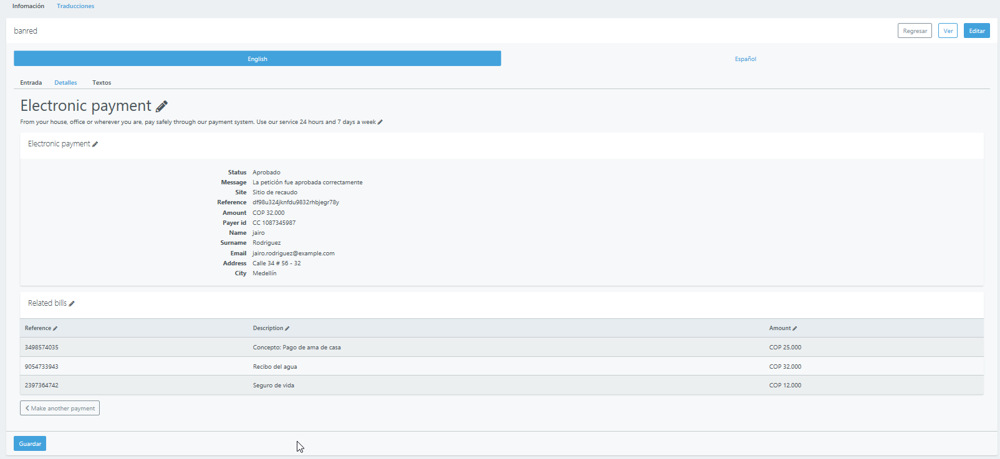

* ***Textos***: A diferencia de todas las opciones de esta sesión, desde aquí no se modifica una traducción sino que se agrega en los campos *Mensaje cuando está deshabilitado* y *terminos y condiciones* de un micrositio, los datos que son entregados por el comercio para que se tengan en cuenta con la traducción de los diferentes idiomas que este nos ofrece.

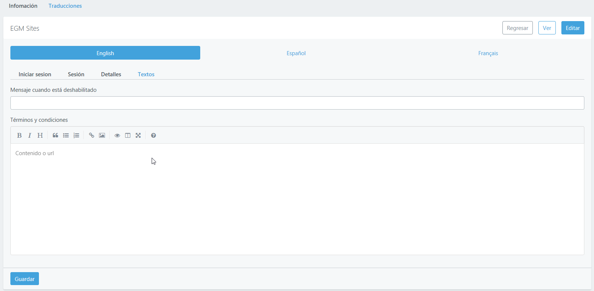

5. Después de que selecciones la vista a modificar puedes ver que la información que permite actualizar la traducción viene con el icono para [editar](/general/icon.md#editar), el cual se debe seleccionar e inmediatamente se desprende un cuadro que va permitir modificar el texto existente por el que se necesite.

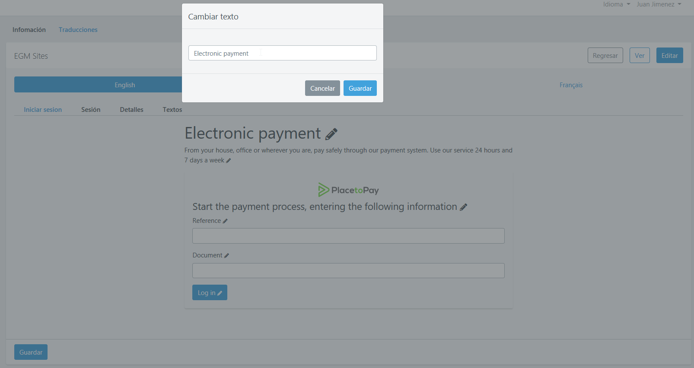

6. Para que los cambios surtan el efecto deseado debes seleccionar el botón **Guardar**.

7. Finalmente cuando se desaparece el formulario donde se edita el texto, debes seleccionar nuevamente el botón **Guardar** ubicada en la parte inferior izquierda del formulario para que los cambios se mantengan, de lo contrario al salir del formulario la información modificada se pierde y debes repetir el proceso.

#### Ver la sesión de acceso a un micrositio

Cuando se ingresa al detalle de un micrositio puedes también seleccionar el botón **Ver** ubicado en la fase superior derecha del formulario.

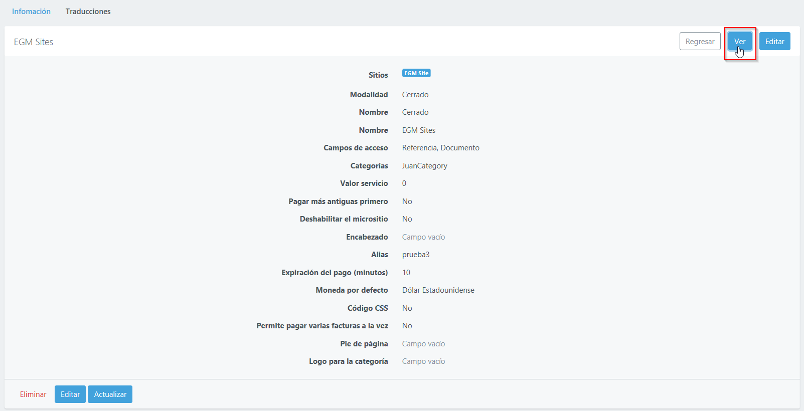

Inmediatamente el sistema te lleva a la sesión de acceso del micrositio para que puedas observar cómo vería el usuario final el micrositio creado con la configuración realizada.

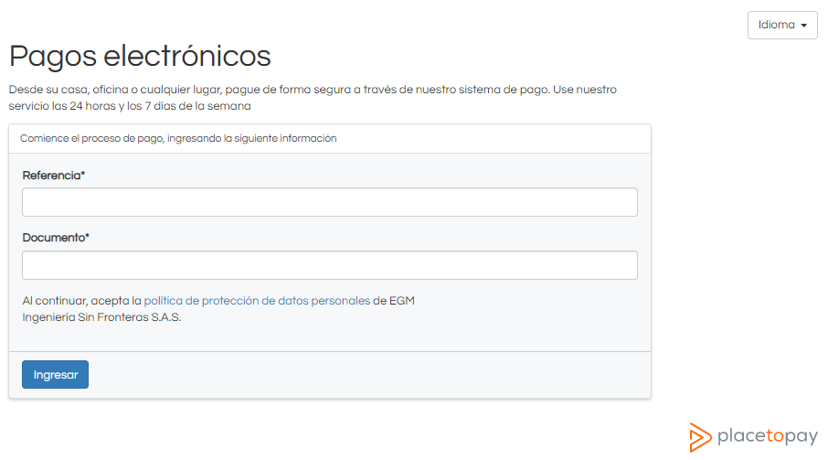

#### Editar un micrositio

Para editar un micrositio debes ingresar al detalle de este y seleccionar el botón **Editar** al ingresar puedes actualizar cada dato que lo compone. Se debe tener en cuenta que antes de hacer una modificación, se debe validar con el comercio para que no se altere o dañe algún dato que se necesite del campo a modificar.

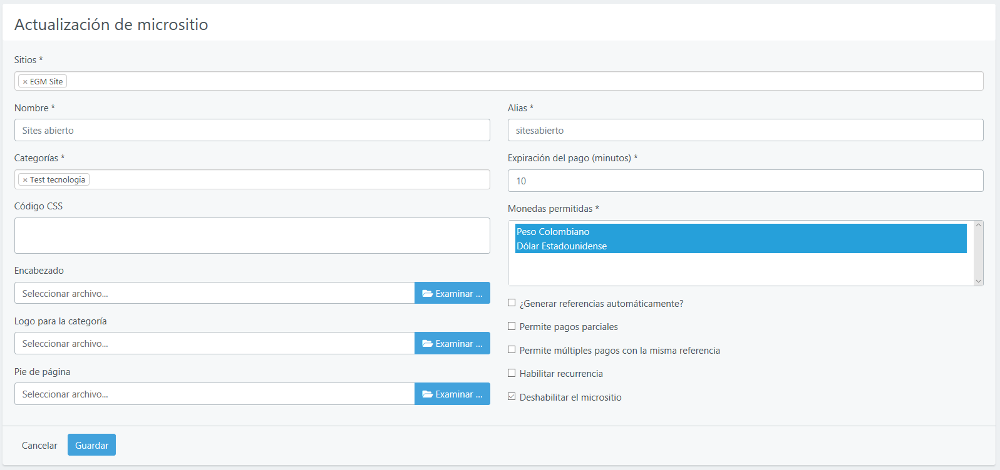

Cuando se termine de actualizar los datos para que se mantengan los cambios realizados debes seleccionar el botón **Guardar** para así finalizar la actualización.

#### Borrar caché del micrositio

Cuando se actualiza un micrositio es necesario borrar la caché para visualizar los cambios y evitar errores en producción, para ello debes ingresar al detalle de este y seleccionar el botón **Actualizar** que se encuentre en la parte inferior izquierda del formulario.

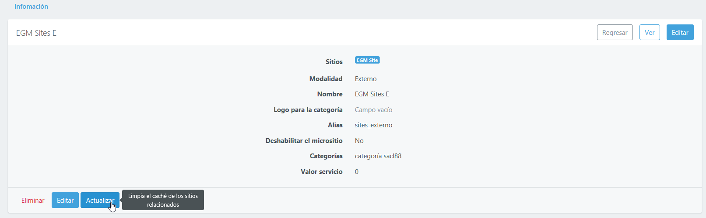

#### Eliminar un micrositio

Para eliminar un micrositio debes ingresar al detalle de este y seleccionar el botón **eliminar** inmediatamente se ejecuta un mensaje donde puedes decidir si aceptas la eliminación o la cancelas.

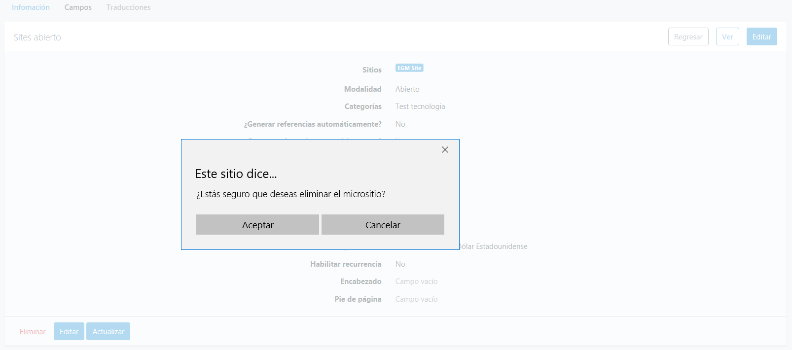

En caso de que el micrositio ya tenga un pago realizado el micrositio no permite eliminarlo físicamente de la base de datos, pero sí puede *Deshabilitar el micrositio* para que no se pueda utilizar por un usuario final.

En caso que un sitio se elimine desde la consola administrativa de PlacetoPay y este tiene un micrositio asociado automáticamente este se deshabilita. 

## Link de pago

Es la funcionalidad que ofrece PlacetoPay para generar un enlace con los datos relevantes como: valor de la venta, referencia de su producto y datos del comprador, para ser utilizado en correos electrónicos, chat o redes sociales.

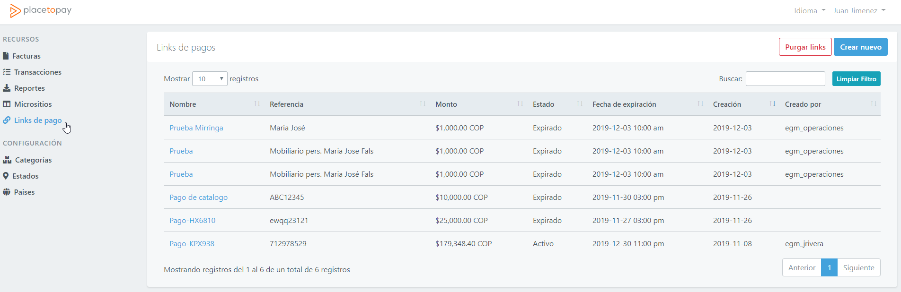

Para la creación de un link de pago se debe tener en cuenta los permisos asociados al sitio de su comercio, y diligenciar los campos que están señalados como obligatorios (*).

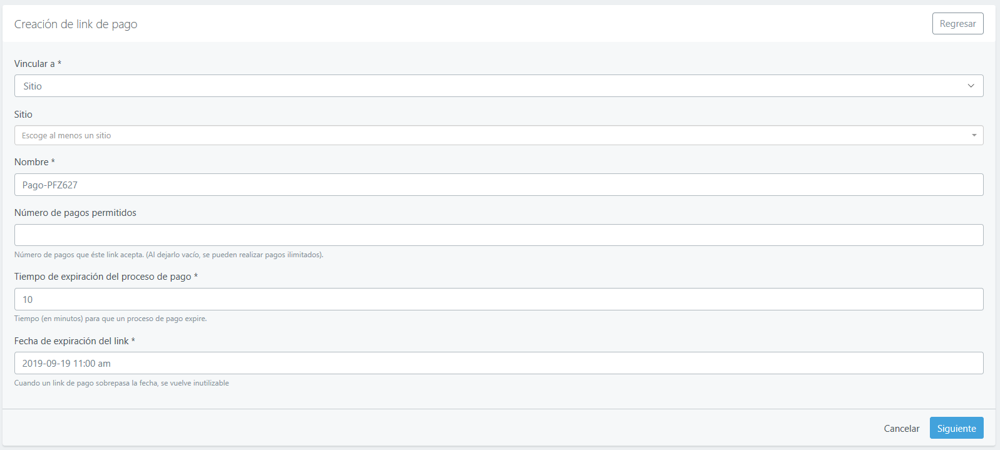

Cuando estamos en la pantalla de creación se deben tener en cuenta los compos:

* El campo **Vincular a** permite seleccionar a que queremos vincular el link de pagos que puede ser un *sitio* o un *micrositio*.

* Si en el campo **Vincular a** se selecciona *sitio* se habilita el campo **Sitio** donde se pueden filtrar los sitios que se encuentren en la [consola de placetopay](https://panel.placetopay.com/) a partir del tercer carácter ingresado en el campo y de esta manera define el sitio al que deseas enviar el link de pagos.

* Si en el campo **Vincular a** se selecciona *micrositio* se habilita el campo **Micrositio** donde se listan los micrositios a los que les puedes enviar un link de pagos y puedes seleccionar uno de ellos.

* Posteriormente puedes agregar un **Nombre** al link de pagos para identificarlo fácilmente o dejar el que el sistema te sugiere de forma aleatoria.

* En el campo **Número de pagos permitidos** debes agregar un número que define la cantidad de pagos permitidos por los tarjetahabiente en el link de pagos. En caso de que no se ingrese ningún número de pagos permitidos no se tendrá un límite de pagos y el link finaliza cuando la *fecha de expiración del link* se cumpla. *Este campo no aplica para los micrositios cerrados*.

* En el **Tiempo de expiración del proceso de pago** permite ingresar un número que determina la cantidad de tiempo en minutos que un tarjetahabiente se puede demorar realizando un pago después de iniciar el proceso. El tiempo mínimo que el campo permite son 10 minutos. *Este campo no aplica para los micrositios cerrados*

* Se debe ingresar la **Fecha de expiración del link** donde al cumplirse el link de pago se vuelve inutilizable.

Para continuar con la configuración del link debes seleccionar el botón **Siguiente** donde se pueden ejecutar las siguientes vistas dependiendo a que se va **Vincular** el link de pagos:

*Vincular a sitio*

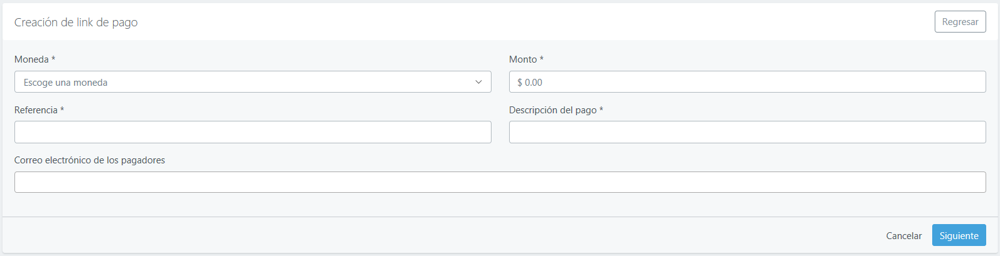

*Vincular a micrositio*

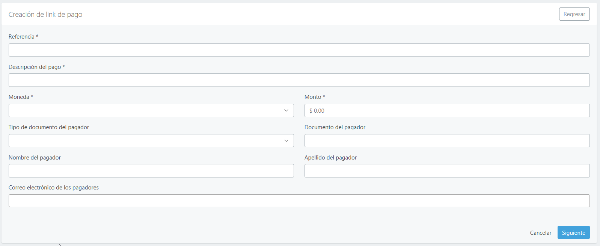

Los campos que aparecerán en estas vistas dependen del tipo de micrositio y de la configuración que se realice al micrositio en el momento de la creación.

Los siguientes campos se nombran por la particularidad que tienen al momento de diligenciar.

* En el campo **Referencia** normalmente se ingresa el número de la factura.
* El campo **Correo electrónico** de los pagadores permite el ingreso de más de un correo electrónico.
* En el campo **Moneda** se listan los tipos de moneda que tenga asociado el sitio en la consola de PlacetoPay o el micrositio en el momento de la creación.

Posteriormente cuando se ingresa toda la información en los campos se debe seleccionar el botón **Siguiente** donde podemos visualizar un resumen de la información que se a ingresado para el link de pagos.

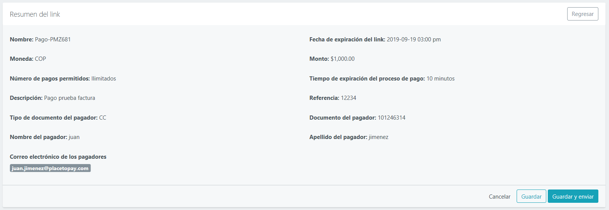

En caso de que la información se quiera corregir se puede seleccionar el botón **Regresar** para que se devuelva a la vista anterior para que modifique los campos que lo necesitan.

Posteriormente debe seleccionar el botón **Guardar** que guarda el link de pagos para que posteriormente lo envíe o puede seleccionar el botón **Guardar y enviar** para que se guarde el link de pagos y de esta manera se envía automáticamente a los correos que ingresó anteriormente. 

*Se aclara que guardar y enviar solo aplica para un link de pagos vinculado a un sitio y a los micrositios abiertos.*
*Para los link de pagos vinculados a micrositios cerrados y personalizados no aplican las funcionalidades que se muestran a continuación ya que estos no generan persistencia en la base de datos por tanto estos solamente generan una url que se puede compartir directamente desde un correo electrónico u otro medio que la puedas copiar para ser enviada a un destinatario y después de terminar todo el proceso nombrado anteriormente no queda registro del link de pago para ser consultado y utilizado nuevamente.*

Cuando seleccionas **Guardar y enviar** el correo electrónico que se envía se ve de la siguiente manera:

Desde aquí el tarjetahabiente al seleccionar el botón **Pagar ahora**, ingresa así a la [plataforma de pago](/user_end/actions.md#plataforma-de-pago) del micrositio, cuando se procede con el pago la plataforma lo lleva inmediatamente a seleccionar el medio de pago evitando que ingrese los datos del tarjetahabiente ya que estos se ingresaron en la creación del link de pagos.

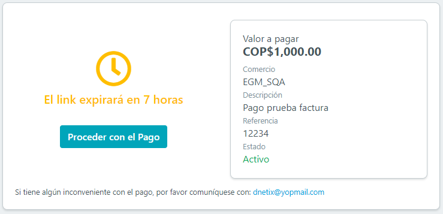

Inmediatamente se genera una nueva vista donde puede visualizar el **Detalle del link** con la información del link de pago creado, los datos del pago y la actividad del link.

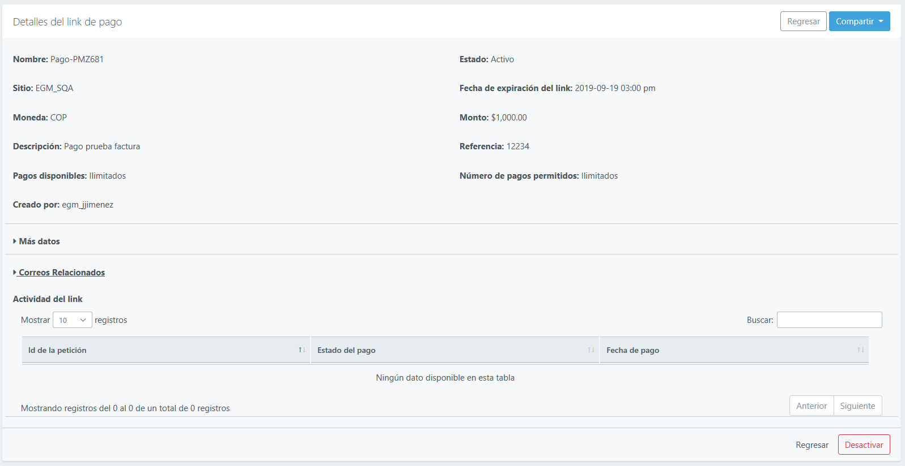

Cuando seleccione **Más datos** el sistema muestra más información que se ingreso al momento de crear el link de pagos.

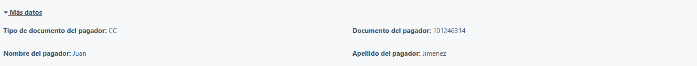

También puedes seleccionar **Correos seleccionados** y podrás ver la lista de correos a los que se les a enviado el link.

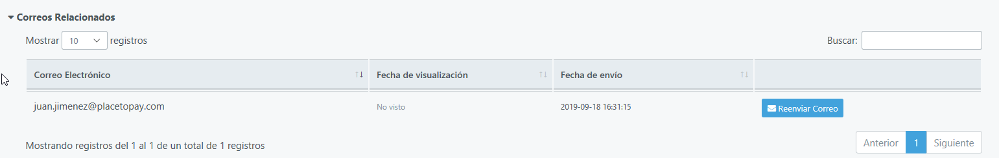

En caso de que al usuario no le llegue el correo electrónico será posible seleccionar en el listado de *correos relacionados* el Botón **Reenviar Correo** para que el usuario lo pueda acceder.

### Funcionalidades del link de pagos

#### Compartir

Después de guardar y enviar el link de pagos este se permite enviar nuevamente por la opción Compartir ubicada en la parte superior derecha de la vista [Detalles del link de pago](/administrator_role/resources.md#ver-detalles-del-link-de-pago) la cual se puede acceder desde el listado de link de pagos creados o también la puedes ver cuando se termina de crear el link de pagos como se mostró anteriormente.

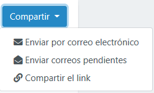

Entres las opciones de compartir están:

* *Enviar por correo electrónico*: Al seleccionar esta opción se desprende un formulario donde puedes ingresar uno o varios correos electrónicos para que se envíe a estos el link de pagos creado.

Adicionalmente puedes seleccionar el idioma en que le debe llegar el correo electrónico al tarjetahabiente, los idiomas que se listen dependen de los que tenga configurados el sitio en la consola administrativa de PlacetoPay.

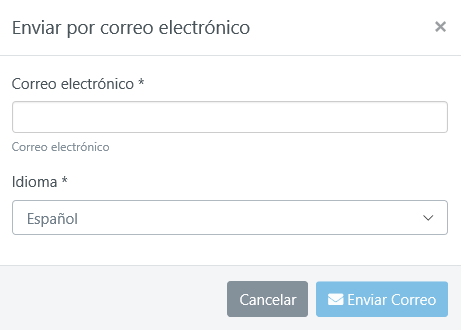

* *Enviar correos pendientes*: Al seleccionar esta opción inmediatamente se envía de forma automática el link de pagos a los correos configurados en la creación del link de pagos que no se hayan enviado.

* *Compartir el link*: Al seleccionar esta opción se desprende un formulario que permite copiar el link de pagos creado para ser enviado por el medio que se desee, como lo puede ser un correo electrónico, un chat, una red social o un mensaje de texto.

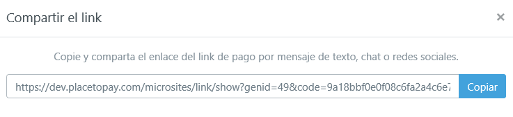

Se aclara que un link de pagos no puede ser editado.

#### Desactivar o Activar un link

El sistema permite activar o desactivar un link de pagos si el administrador del sistema lo requiere, desde la vista de **Detalles de transacción**, la cual se puede acceder desde el listado de link de pagos creados o también la puedes ver cuando se termina de crear el link de pagos, para usar esta funcionalidad se deben tener en cuenta: 

* Para poder desactivar un link de pagos debe estar activo y no se debe tener ninguna transacción realizada por un usuario final.
* Cuando se desactiva un link de pagos, el estado de este debe pasar a estado inactivo.

Un link de pago que esté en estado inactivo se debe poder activar, teniendo en cuenta:

* Si el tiempo de expiración no a terminado, se activa el link con el tiempo faltante.
* Si el tiempo de expiración asignado ya está en el pasado, se asignan 24 horas automáticamente en el tiempo de expiración, partiendo de la fecha en que se active el link.

#### Purgar links

Cuando un link es utilizado o ya a expirado se puede quitar del sistema.

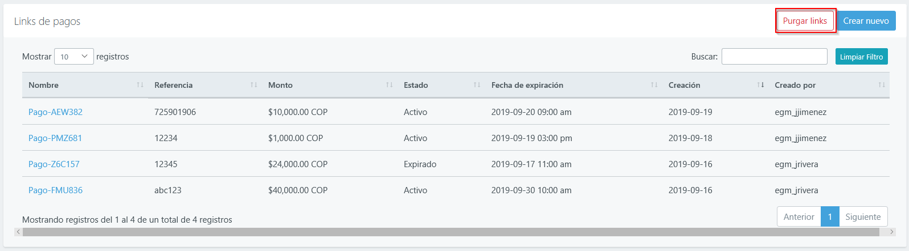

Al ingresar a la opción de link de pagos se desprende el listado de todos los link que se han creado y en la parte superior derecha se visualiza el botón **Purgar link**, si este se selecciona se desprende la siguiente vista.

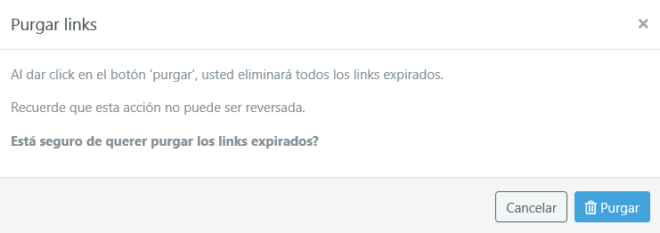

Esta vista informa que al seleccionar el botón **Purgar** "se eliminarán todos los link expirados y la acción no podría ser reversada", por tanto es importante estar seguros antes de ejecutar la acción aunque en caso de necesitar un link borrado lo va poder volver a crear.

#### Ver detalles del Link de pago

Al igual que en la opción de **Purgar link**, al ingresar a la opción de link de pagos puede ver todos los link que se han creado y no han sido purgados para consultarlos, para acceder a uno de ellos solo debe seleccionar el nombre:

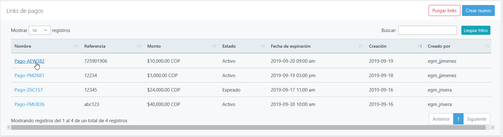

Inmediatamente se muestra el **Detalle del link de pagos** donde puede hacer uso de las funcionalidades que estén activas en el momento para el link seleccionado.

  
## Seguridad

Desde la [consola administrativa de PlacetoPay](https://panel.placetopay.com/) el admisnitrador de la misma es el encargado de la creación de usuarios, restauración de contraseñas, asignación de roles y permisos a los diferentes módulos o funcionalidades que presta la plataforma de micrositios.