# Configuraciones

## Categorías

Las categorías permiten tipificar a los micrositios para que los usuarios puedan identificarlos de una forma amigable y fácil al momento de querer interactuar con alguno de ellos.

Las categorías se utilizan en el momento de [crear un micrositio](/administrator_role/resources.md#micrositios), donde debes asociar el micrositio que se vaya a crear a una categoría.

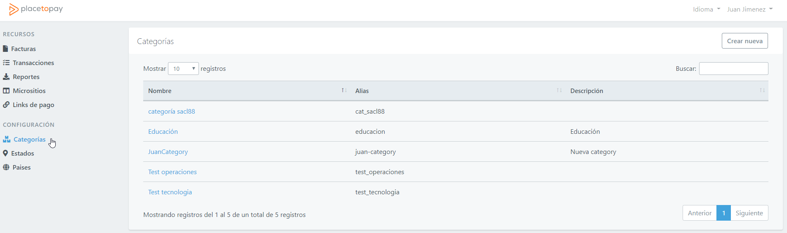

Para crear una categoría debes seleccionar el botón **Crear nueva** ubicado en la parte superior derecha de la vista, inmediatamente se visualiza un nuevo formulario para la creación de la categoría.

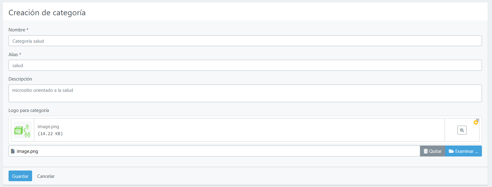

En este debes de ingresar el nombre de la categoría, un alias que puede ser el mismo nombre de la categoría, una descripción que resume a que se refiere la categoría y finalmente puedes seleccionar un logo que tengas guardado y permita identificar la categoría visualmente al usuario final desde la [url de sites](https://sites.placetopay.com/).

Al terminar de ingresar los datos debes seleccionar el botón **Guardar** para que termines la creación de la categoría.

### Editar o Eliminar categorías

Para editar una categoría debes seleccionar desde el listado de categorías el nombre de la categoría que desees actualizar.

Inmediatamente se ejecuta una nueva vista donde puedes modificar cualquier campo de la categoría.

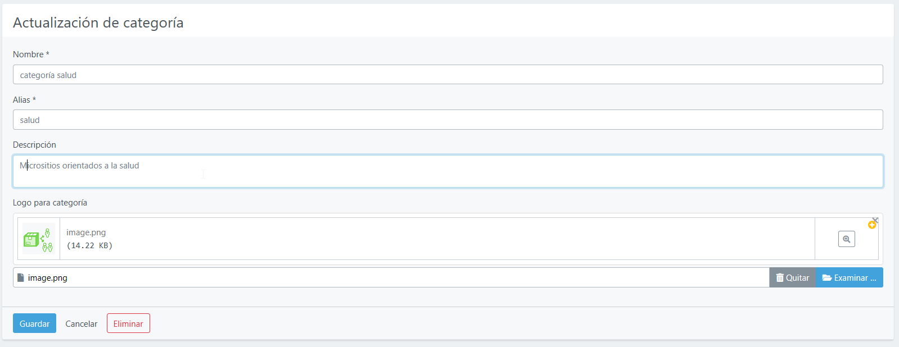

Para terminar la edición debes de Guardar para que no pierdas las modificaciones realizadas.

Desde esta misma vista puedes eliminar una categoría seleccionando el botón **Eliminar**, debes tener en cuenta que el sistema no va permitir eliminar una categoría si ya está asociada a un micrositio.

## Estados

Desde esta funcionalidad puedes crear los estados (Departamentos) con los que el sistema va interactuar en las diferentes funcionalidades que lo requieran.

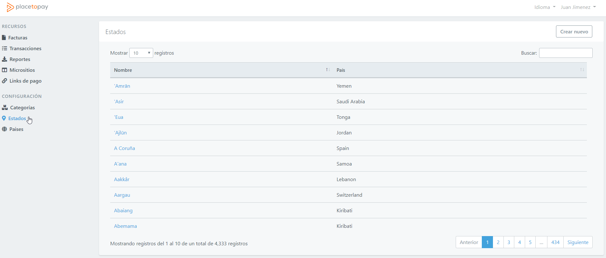

Para crear un estado debes seleccionar el botón **Crear nuevo** ubicado en la parte superior derecha de la vista, inmediatamente se visualiza un nuevo formulario para la creación de un estado.

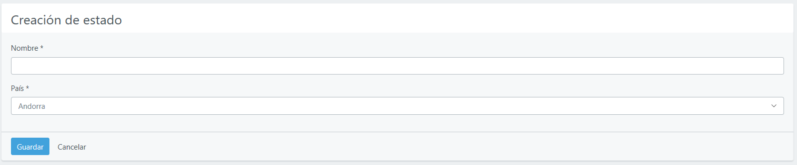

En este debes de ingresar el nombre del estado, y seleccionar el país al que pertenece este.

Al terminar de ingresar los datos debes seleccionar el botón **Guardar** para que termines la creación del estado.

### Editar o Eliminar estados

Para editar un estado debes seleccionar desde el listado de estados el nombre de aquel que desees actualizar.

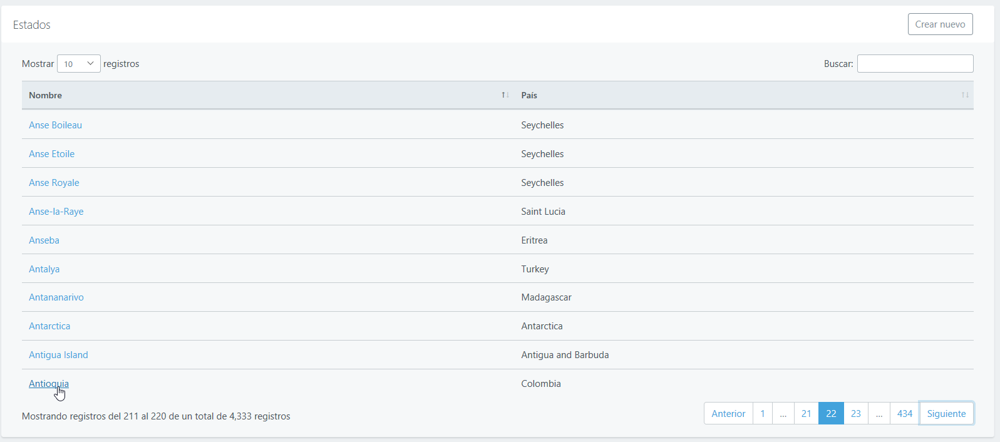

Inmediatamente se ejecuta una nueva vista donde puedes modificar cualquier campo del estado.

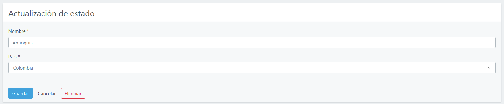

Para terminar la edición debes de Guardar para que no pierdas las modificaciones realizadas.

Desde esta misma vista puedes eliminar un estado seleccionando el botón **Eliminar**, debes tener en cuenta que el sistema no va permitir eliminar un estado si ya se a hecho uso de este en otra funcionalidad del sistema.

## Países

Desde esta funcionalidad puedes crear los países con los que el sistema va interactuar en las diferentes funcionalidades que lo requieran.

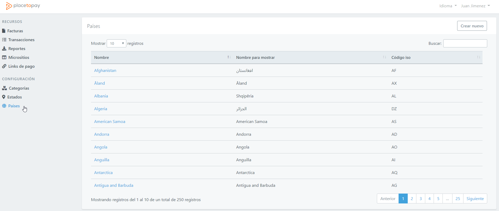

Para crear un país debes seleccionar el botón **Crear nuevo** ubicado en la parte superior derecha de la vista, inmediatamente se visualiza un nuevo formulario para la creación de un estado.

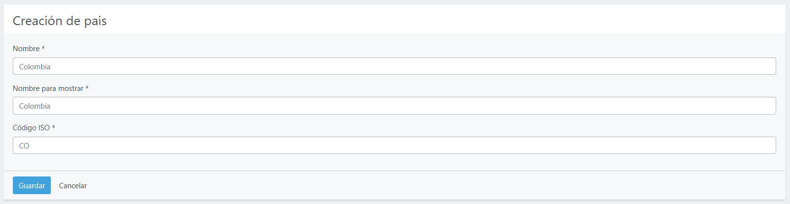

En este debes de ingresar el nombre del país, un nombre para mostrar que puede ser el nombre escrito en el idioma del país y el código ISO del país.

Al terminar de ingresar los datos debes seleccionar el botón **Guardar** para que termines la creación del país.

### Editar o Eliminar países

Para editar un país debes seleccionar desde el listado de países el nombre de aquel que desees actualizar.

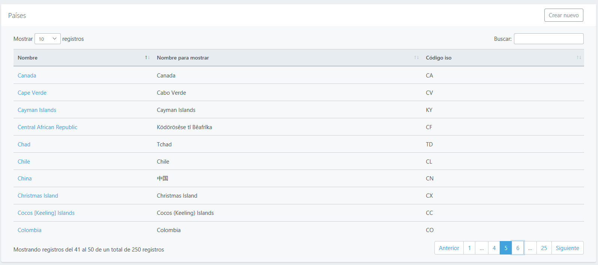

Inmediatamente se ejecuta una nueva vista donde puedes modificar cualquier campo del país.

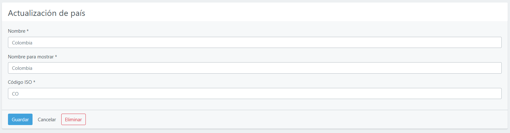

Para terminar la edición debes de guardar para que no pierdas las modificaciones realizadas.

Desde esta misma vista puedes eliminar un país seleccionando el botón **Eliminar**, debes tener en cuenta que el sistema no va permitir eliminar un país si ya se a hecho uso de este en otra funcionalidad del sistema, como lo puede ser la funcionalidad de [Estados](/administrator_role/settings.md#estados).