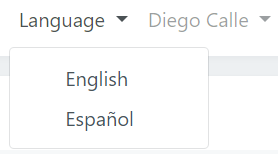
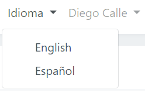
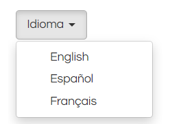

# Idioma

El sistema desde los módulos de administración y configuración cuenta con dos idiomas, español e inglés, estos se podrán seleccionar e intercambiar en cualquier momento.

Se podrá cambiar dando clic en Idioma/Language y seleccionando el idioma deseado:

  

Un micrositio creado pueden tener varios idiomas todo depende de la cantidad de idiomas que se configuren al comercio desde del sistema [Core de Placetopay](https://panel.placetopay.com/).

