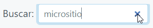
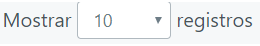

# Filtros

En todos los módulos del software se encontrarán varias listas con diferentes tablas de datos, a estas tablas se le pueden realizar filtros, entre los que se encuentran:

- Escribir en el buscador del sistema: 
   
   Se puede escribir cualquier dato que se encuentre en los registros o tablas e inmediatamente el sistema automáticamente procesa la consulta y muestra los registros con campos o datos similares al escrito.
   
   
  
  Después de filtrar, si desea volver a ver todos los registros, podrá oprimir **Limpiar** y posteriormente **Filtrar** de nuevo.
  
   

- Número de registros por página y cambio de páginas:
  
  En los listados se dispondrá de un sistema de páginas en el que se podrá escoger cuantos registros se muestran por página seleccionandolo en **Mostar registros** en la parte superior de la tabla o lista.
  
  
  
  También se puede avanzar o retroceder entre las páginas, seleccionando en la parte inferior de las tablas o listas.

  
