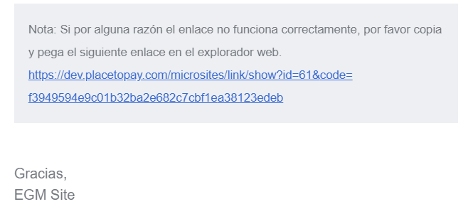

# Solución a posibles problemas

A continuación se muestran algunos casos que se podrían presentar en algunas de las funcionalidades del sistema y como este ayuda a dar solución. 

1. Cuando al usuario se le envía al correo un link o un mensaje de alerta pueden aparecer mensajes que ayudan a dar solución a un posible problema. 
   
   