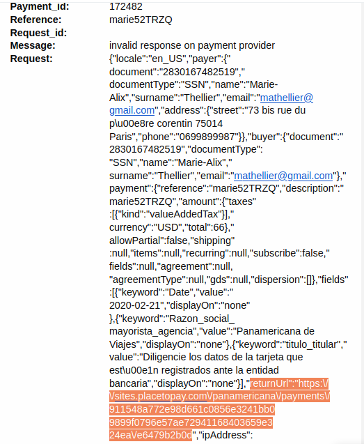
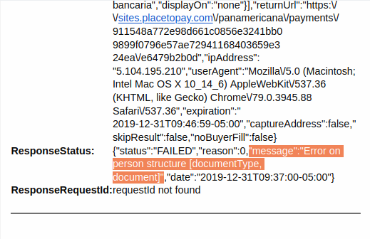
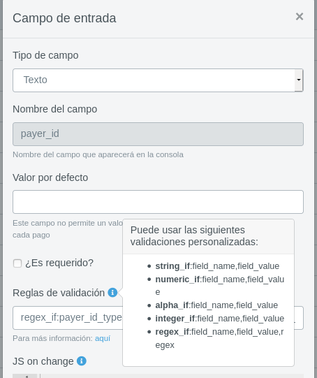
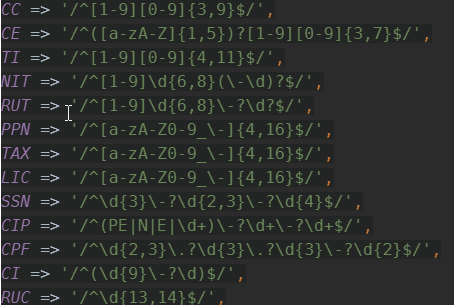

# Solución a posibles problemas

A continuación se muestran algunos casos que se podrían presentar en algunas de las funcionalidades del sistema y como este ayuda a dar solución. 

1. Cuando al usuario se le envía al correo un link o un mensaje de alerta pueden aparecer mensajes que ayudan a dar solución a un posible problema. 
   
   

2. ¿Cómo se identifica a que micrositio está asociada una alerta?  

Cuando a un administrador de micrositios le llega una alerta dentro del correo encontrará una petición (request) realizada a redirección, dentro de esta puede ver la url de retorno y ahí se observa el micrositio.

   

3. ¿Cómo identificar en una alerta un campo que no está correctamente configurado?  

Dentro del estado de la respuesta que se observa en la alerta existe un mensaje que describe de manera técnica la causa del error, los errores principalmente identificados son asociados a la combinación tipo y número de identificación y nombre o apellido del pagador con estructura incorrecta.

   

4. ¿Cómo debo validar los tipos y números de documentos?  

Una vez identificados y definidos los posibles tipos de documentos que tendrá un micrositio abierto en los campos personalizados, debe realizar una validación para cada uno de estos tipos.

   

* Ejemplo:  
Si definimos que el pagador sólo podrá escoger para su tipo de documento entre CC y CE, entonces debemos añadir dos **Reglas de validación** en el campo de payer_id, una para CC y otra para CE, las validaciones se verán de la siguiente forma:
regex_if:payer_id_type,cc,/^[1-9][0-9]{3,9}$/|regex_if:payer_id_type,ce,/^([a-zA-Z]{1,5})?[1-9][0-9]{3,7}$/

Expresiones regulares que soporta micrositios y que se pueden agregar en el campo **Reglas de validación**.

