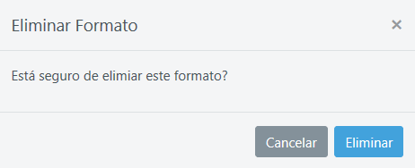
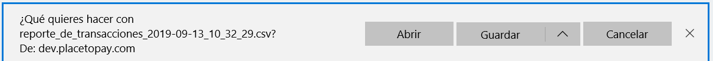

# Iconos

### Visualizar

Al seleccionar el icono  el usuario puede visualizar la configuración o detalle del registro almacenado en el sistema.

### Editar

Cuando selecciones el icono  puedes editar la configuración de un registro para ser ajustado si lo requieres.

### Eliminar 

Para eliminar un registro debes seleccionar el icono  inmediatamente el sistema debe generar un mensaje, que te permite decidir si deseas continuar con la eliminación o cancelar el proceso.

### Descargar

Para proceder a descargar un archivo se debe seleccionar el icono  inmediatamente se desprende un recuadro emergente que te permite abrir el documento descargado, guardar la descarga o cancelar el proceso.

