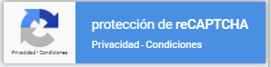
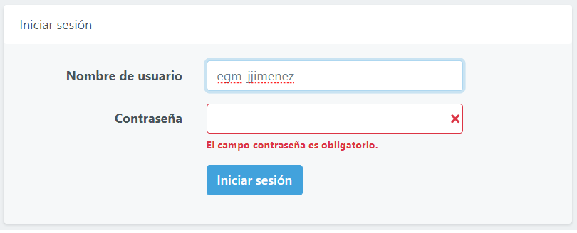
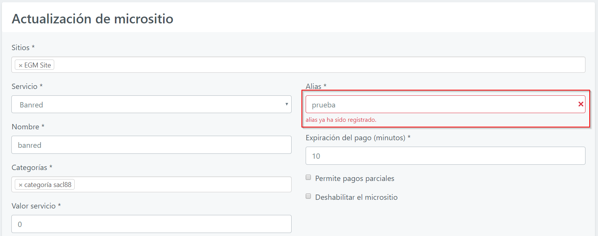
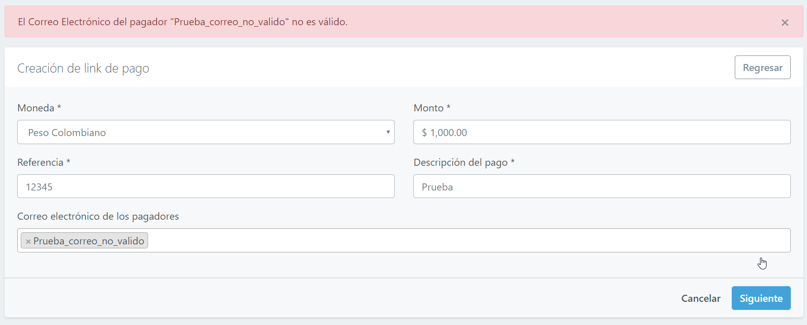
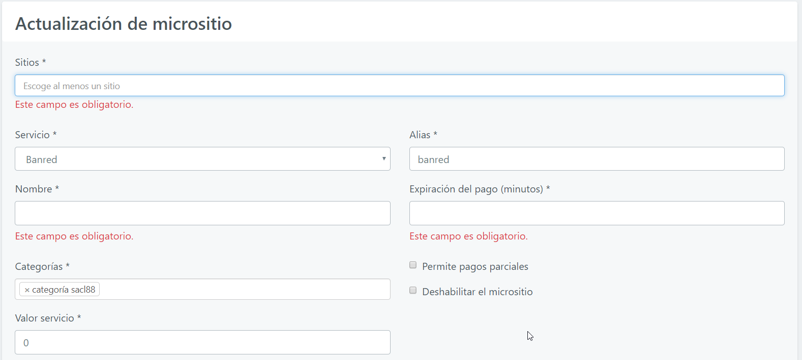
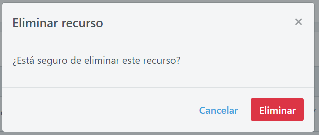
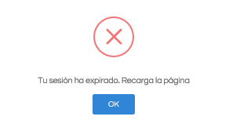

# Medidas de seguridad y contingencia

1. El software cerrará cualquier sesión automáticamente en 30 minutos por inactividad, este tiempo lo puede configurar un administrador en la parametrización.

2. En la página de inicio de sesión en la parte inferior derecha la aplicación cuenta con protección de **"reCAPTCHA"** para validar que la aplicación sea manipulada por personas y no por una máquina o robots informáticos.

    
    
3. Otros elementos que se utilizan dentro del sistema son los mensajes o notas informativas que permiten dar a conocer al usuario sobre los datos que se deben ingresar en algunos campos. 
  
    

4. También dentro del sistema se utilizan validaciones que permiten notificar al usuario sobre los errores que está cometiendo al ingresar un dato en un campo. 

    

5. Cuando se trata de ingresar un dato errado en un campo el sistema no lo permite generando un mensaje de error.

    
  
6. Al diligenciar campos de un formulario, es necesario diligenciar los campos obligatorios, los cuales se identifican por tener un  **"\*"** . Los demás campos serán opcionales y se podrá completar la acción a ejecutar sin estos campos.
  
    

7. En el momento en que se intenta eliminar un registro el sistema genera un mensaje de advertencia, dándole la oportunidad al usuario a que **Cancele** o **Confirme** la eliminación como se muestra en la imagen.

    

8. Cuando una sesión cumple el tiempo de inactividad y se quiere realizar un pago se genera un mensaje emergente donde se informa al usuario que la sesión ha expirado por tanto este debe ingresar nuevamente para poder hacer uso de la plataforma de pago.

 