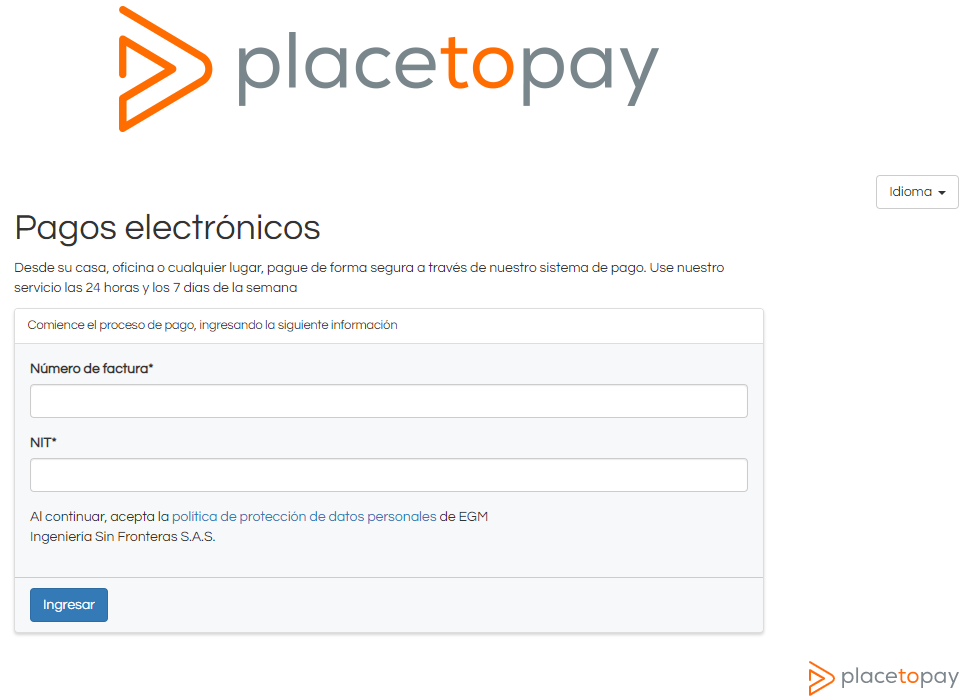
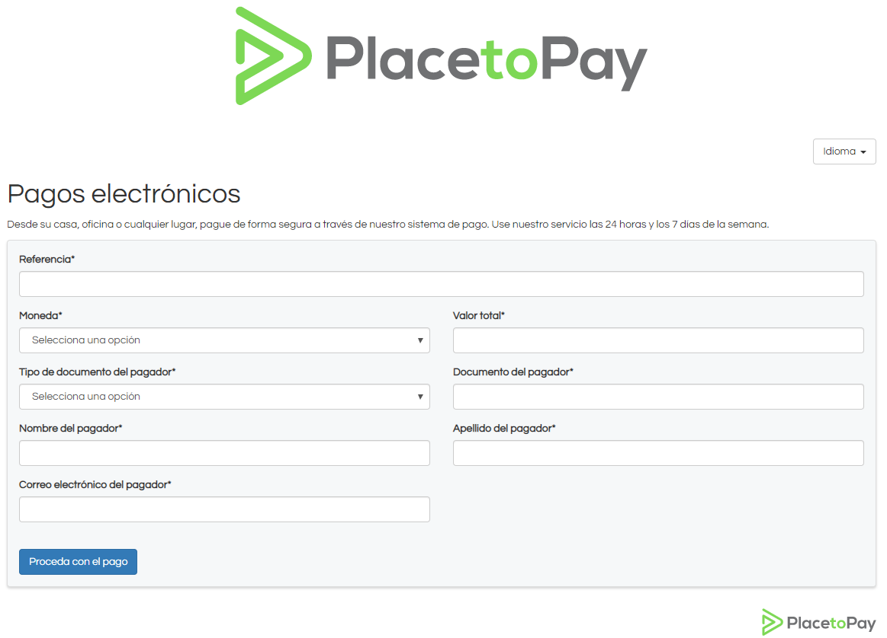
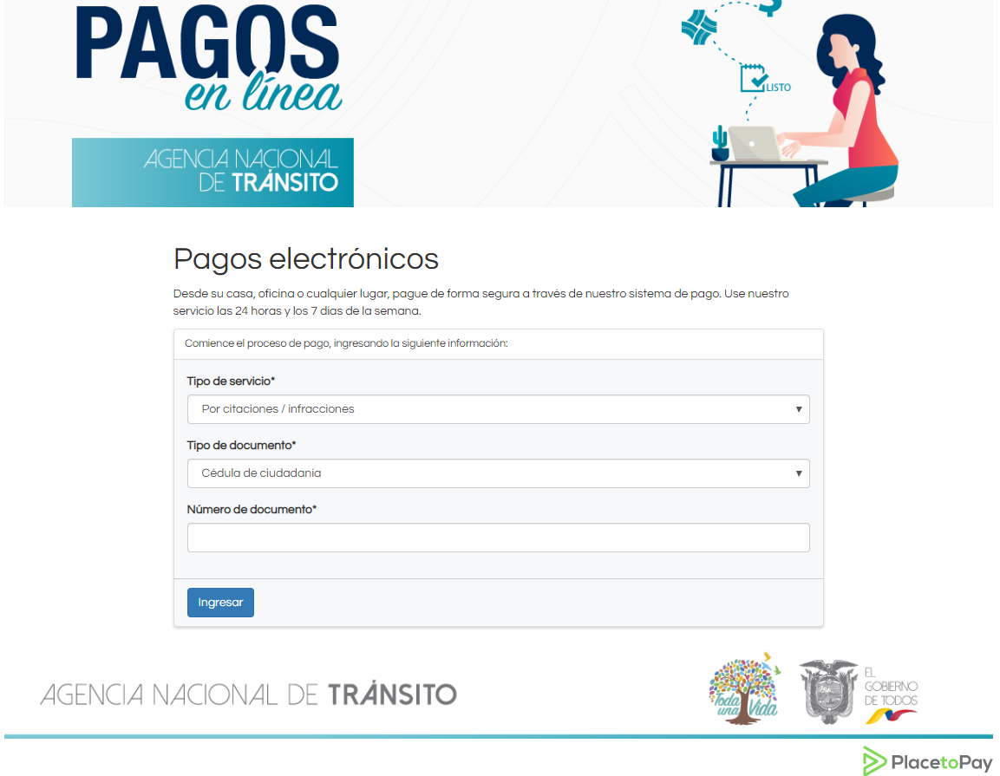
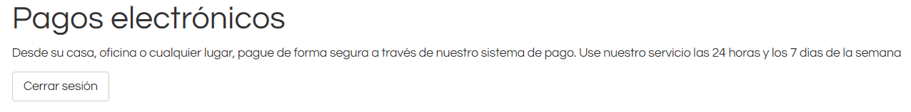

# Entrada y salida del software

##  Ingreso

Dependiendo del tipo de Micrositio que haya adquirido se abrirá un formulario accediendo por un navegador a la dirección que se haya asignado a este.

Cuando acceda a un micrositio puede ver formularios diferentes, dependiendo del tipo de micrositio como se muestra a continuación:

### Micrositio cerrado

Para poder realizar un pago el usuario debe ingresar los campos de acceso que se configuran previamente en el momento de la creación de un micrositio. Los campos de acceso se validan conjuntamente frente a los datos almacenados en las base de datos de Placetopay, lo que permite consultar los registros pendientes de pago.

Para ingresar a este formulario ingrese al ["Link"](https://sites.placetopay.com/egm/login)

Una vez dentro de la página, para acceder al micrositio se da clic en **Ingresar** 

### Micrositio abierto

Para poder realizar un pago en un micrositio abierto el usuario debe ingresar los datos en los campos configurados previamente en el momento de la creación del micrositio y de esta manera identificar quién está gestionando el pago y que factura o referencia desea pagar.

Para ingresar a este formulario ingrese al ["Link"](https://sites.placetopay.com/egm_abierto)

Una vez dentro de la página, para acceder al micrositio se da clic en **Proceda con el pago**, inmediatamente el sistema lo redirecciona a la [**plataforma de pago**](/user_end/actions.md#plataforma-de-pago), donde realiza el proceso transaccional. 

### Micrositio personalizado

Para poder acceder a un micrositio personalizado se deben diligenciar los campos de acceso configurados previamente en el momento de creación del micrositio, donde el comercio define los campos con los cuales se debe consultar las facturas pendientes de pago en la base de datos del comercio.

Los campos de ingreso pueden ser diferentes para cada comercio, y se deben configurar previamente desde el proceso de integración del comercio. Todo depende de lo que ellos soliciten en el momento de integrar. 

Para ingresar a este formulario ingrese al ["Link"](https://sites.placetopay.ec/ant/login)

Una vez dentro de la página, para acceder al micrositio se da clic en **Ingresar**.

## Salida

Para salir del sistema se podrá hacer de varias formas.

- La forma más segura es seleccionar el botón **Cerrar sesión**  que se encuentra en la parte superior izquierda de la ventana de los micrositios cerrados y personalizados, donde al seleccionar se saldrá de la sesión.
  
  

- Para los micrositios abiertos cuando ya se encuentra dentro de la sesión de pago puede cancelar el proceso seleccionando la opción que dice: **No deseo continuar el proceso**. De esta manera finaliza la sesión regresando al usuario al formulario inicial.

- Se podrá salir del sistema cerrando la pestaña del navegador o cerrando directamente el navegador, sin embargo la sesión no se cerrará automáticamente, por lo que al ingresar a la URL de nuevo, es posible que entre con la sesión iniciada generando brechas de seguridad. 
